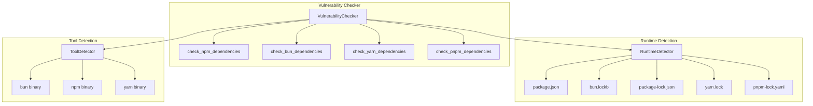
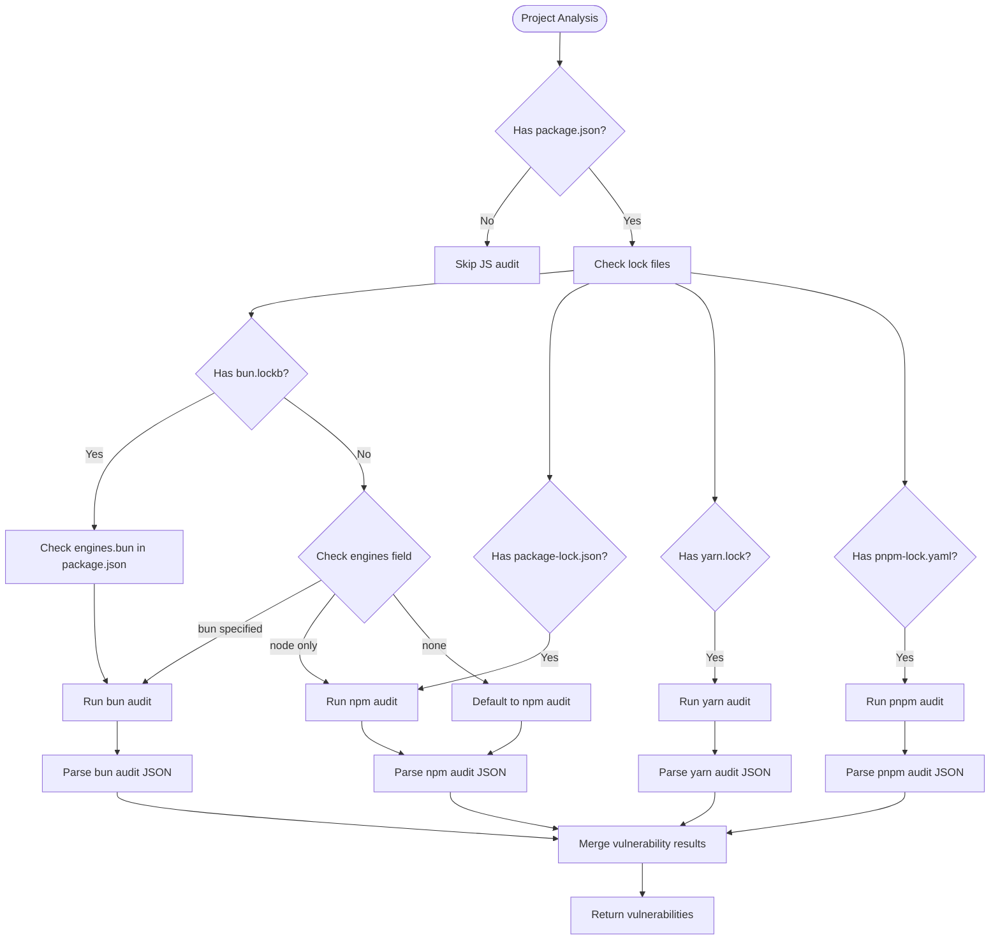
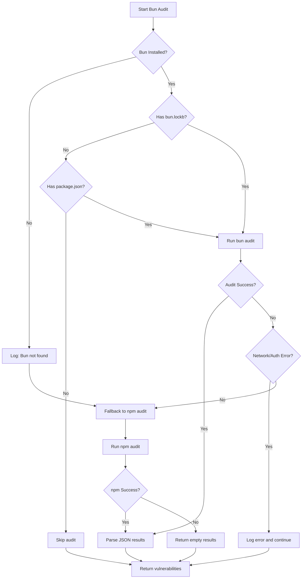

# Bun Audit Integration Design

## Overview

This design extends the syncable-cli vulnerability checking system to support bun audit for JavaScript/TypeScript projects using Bun as the runtime and package manager. The integration detects Bun projects through `bun.lockb` files or Bun-specific configurations and executes `bun audit` alongside other Node.js runtime audits.

## Requirements Analysis

### Current State
- **Existing Vulnerability Checker**: Supports npm audit, yarn audit, pip-audit, cargo-audit, govulncheck, and various Java scanners
- **Bun Detection**: Basic framework detection exists for Bun runtime but no audit integration
- **Lock File Recognition**: `bun.lockb` files are recognized for security scanning exclusion
- **Node.js Runtime Support**: Currently only npm audit is supported for JavaScript/TypeScript projects

### Key Requirements
1. **Bun Project Detection**: Identify projects using Bun through `bun.lockb` presence or package.json engines field
2. **Multi-Runtime Support**: Execute appropriate audit tools based on detected package managers and runtimes
3. **Bun Audit Integration**: Execute `bun audit` command and parse JSON output
4. **Backwards Compatibility**: Maintain existing npm/yarn audit functionality
5. **Error Handling**: Graceful fallback when bun is not installed

## Architecture

### Component Integration



### Runtime Detection Strategy



## Detailed Component Design

### JavaScript Runtime Detection Enhancement

```rust
#[derive(Debug, Clone, PartialEq)]
pub enum JavaScriptRuntime {
    Bun,
    Node,
    Deno,
    Unknown,
}

#[derive(Debug, Clone, PartialEq)]
pub enum PackageManager {
    Bun,
    Npm,
    Yarn,
    Pnpm,
    Unknown,
}

pub struct RuntimeDetector {
    project_path: PathBuf,
}

impl RuntimeDetector {
    pub fn detect_js_runtime_and_package_manager(&self) -> (JavaScriptRuntime, PackageManager) {
        // Priority: Lock files > engines field > default
        if self.project_path.join("bun.lockb").exists() {
            return (JavaScriptRuntime::Bun, PackageManager::Bun);
        }
        
        if self.project_path.join("pnpm-lock.yaml").exists() {
            return (JavaScriptRuntime::Node, PackageManager::Pnpm);
        }
        
        if self.project_path.join("yarn.lock").exists() {
            return (JavaScriptRuntime::Node, PackageManager::Yarn);
        }
        
        if self.project_path.join("package-lock.json").exists() {
            return (JavaScriptRuntime::Node, PackageManager::Npm);
        }
        
        // Check package.json engines field
        if let Ok(package_json) = self.read_package_json() {
            if let Some(engines) = package_json.get("engines") {
                if engines.get("bun").is_some() {
                    return (JavaScriptRuntime::Bun, PackageManager::Bun);
                }
            }
        }
        
        // Default to Node.js with npm
        (JavaScriptRuntime::Node, PackageManager::Npm)
    }
}
```

### Enhanced Vulnerability Checker Methods

```rust
impl VulnerabilityChecker {
    fn check_npm_dependencies(
        &self,
        dependencies: &[DependencyInfo],
        project_path: &Path,
    ) -> Result<Vec<VulnerableDependency>, VulnerabilityError> {
        let runtime_detector = RuntimeDetector::new(project_path);
        let (runtime, package_manager) = runtime_detector.detect_js_runtime_and_package_manager();
        
        match package_manager {
            PackageManager::Bun => self.check_bun_dependencies(dependencies, project_path),
            PackageManager::Npm => self.check_npm_audit(dependencies, project_path),
            PackageManager::Yarn => self.check_yarn_audit(dependencies, project_path),
            PackageManager::Pnpm => self.check_pnpm_audit(dependencies, project_path),
            PackageManager::Unknown => {
                // Fallback to multiple audits if available
                self.check_multiple_js_audits(dependencies, project_path)
            }
        }
    }
    
    fn check_bun_dependencies(
        &self,
        dependencies: &[DependencyInfo],
        project_path: &Path,
    ) -> Result<Vec<VulnerableDependency>, VulnerabilityError> {
        info!("Checking JavaScript dependencies with bun audit");
        
        // Check if bun is available
        let mut tool_detector = crate::analyzer::tool_detector::ToolDetector::new();
        let bun_status = tool_detector.detect_tool("bun");
        
        if !bun_status.available {
            warn!("bun not found. Install from https://bun.sh/");
            warn!("Falling back to npm audit if available");
            return self.check_npm_audit(dependencies, project_path);
        }
        
        info!("Using bun {} at {:?}", 
              bun_status.version.as_deref().unwrap_or("unknown"),
              bun_status.path.as_deref().unwrap_or_else(|| std::path::Path::new("bun")));
        
        // Check if project has bun.lockb or package.json
        if !project_path.join("bun.lockb").exists() && !project_path.join("package.json").exists() {
            debug!("No bun.lockb or package.json found, skipping bun audit");
            return Ok(vec![]);
        }
        
        // Run bun audit with JSON output
        let output = Command::new("bun")
            .args(&["audit", "--json"])
            .current_dir(project_path)
            .output()
            .map_err(|e| VulnerabilityError::CommandError(
                format!("Failed to run bun audit: {}", e)
            ))?;
        
        // bun audit exits with code 1 if vulnerabilities found, which is expected
        if output.stdout.is_empty() {
            if output.status.success() {
                info!("bun audit completed - no vulnerabilities found");
                return Ok(vec![]);
            } else {
                let stderr = String::from_utf8_lossy(&output.stderr);
                return Err(VulnerabilityError::CommandError(
                    format!("bun audit failed: {}", stderr)
                ));
            }
        }
        
        // Parse bun audit output (should be compatible with npm audit format)
        let audit_data: serde_json::Value = serde_json::from_slice(&output.stdout)?;
        
        self.parse_bun_audit_output(&audit_data, dependencies)
    }
    
    fn parse_bun_audit_output(
        &self,
        audit_data: &serde_json::Value,
        dependencies: &[DependencyInfo],
    ) -> Result<Vec<VulnerableDependency>, VulnerabilityError> {
        // Bun audit uses NPM's API, so format should be similar to npm audit
        // Check if it's empty response (no vulnerabilities)
        if let Some(vulnerabilities) = audit_data.get("vulnerabilities") {
            if vulnerabilities.as_object().map_or(true, |v| v.is_empty()) {
                info!("bun audit found no vulnerabilities");
                return Ok(vec![]);
            }
        }
        
        // Reuse npm audit parser since bun uses NPM registry
        self.parse_npm_audit_output(audit_data, dependencies)
    }
    
    fn check_multiple_js_audits(
        &self,
        dependencies: &[DependencyInfo],
        project_path: &Path,
    ) -> Result<Vec<VulnerableDependency>, VulnerabilityError> {
        let mut all_vulnerabilities = Vec::new();
        
        // Try bun first if available
        if let Ok(mut bun_vulns) = self.check_bun_dependencies(dependencies, project_path) {
            all_vulnerabilities.append(&mut bun_vulns);
        }
        
        // Try npm if no bun results
        if all_vulnerabilities.is_empty() {
            if let Ok(mut npm_vulns) = self.check_npm_audit(dependencies, project_path) {
                all_vulnerabilities.append(&mut npm_vulns);
            }
        }
        
        // Try yarn as fallback
        if all_vulnerabilities.is_empty() {
            if let Ok(mut yarn_vulns) = self.check_yarn_audit(dependencies, project_path) {
                all_vulnerabilities.append(&mut yarn_vulns);
            }
        }
        
        Ok(all_vulnerabilities)
    }
}
```

### Tool Detection Enhancement

The existing ToolDetector needs enhancement to detect bun installations:

```rust
impl ToolDetector {
    pub fn detect_bun(&mut self) -> ToolStatus {
        self.detect_tool_with_alternatives("bun", &[
            "bun",
            "bunx", // Bun's npx equivalent
        ])
    }
    
    pub fn detect_js_package_managers(&mut self) -> HashMap<String, ToolStatus> {
        let mut managers = HashMap::new();
        managers.insert("bun".to_string(), self.detect_bun());
        managers.insert("npm".to_string(), self.detect_tool("npm"));
        managers.insert("yarn".to_string(), self.detect_tool("yarn"));
        managers.insert("pnpm".to_string(), self.detect_tool("pnpm"));
        managers
    }
}
```

### Tool Installation Integration

The ToolInstaller needs to support installing bun:

```rust
impl ToolInstaller {
    pub fn install_bun(&mut self) -> Result<(), Box<dyn std::error::Error>> {
        info!("Installing Bun runtime and package manager...");
        
        // Check if already installed
        if self.tool_detector.detect_tool("bun").available {
            info!("✅ Bun is already installed");
            return Ok(());
        }
        
        // Install bun using their official installer
        let install_cmd = if cfg!(target_os = "windows") {
            Command::new("powershell")
                .args(&["-c", "irm bun.sh/install.ps1 | iex"])
                .output()
        } else {
            Command::new("curl")
                .args(&["-fsSL", "https://bun.sh/install", "|", "bash"])
                .output()
        };
        
        match install_cmd {
            Ok(output) if output.status.success() => {
                info!("✅ Bun installed successfully");
                // Refresh cache
                self.tool_detector.clear_cache();
                Ok(())
            }
            Ok(output) => {
                let stderr = String::from_utf8_lossy(&output.stderr);
                Err(format!("Bun installation failed: {}", stderr).into())
            }
            Err(e) => Err(format!("Failed to execute bun installer: {}", e).into())
        }
    }
    
    pub fn ensure_js_audit_tools(&mut self, detected_managers: &[PackageManager]) -> Result<(), Box<dyn std::error::Error>> {
        for manager in detected_managers {
            match manager {
                PackageManager::Bun => self.install_bun()?,
                PackageManager::Npm => self.install_npm()?,
                PackageManager::Yarn => self.install_yarn()?,
                PackageManager::Pnpm => self.install_pnpm()?,
                PackageManager::Unknown => {
                    // Install npm as default
                    self.install_npm()?;
                }
            }
        }
        Ok(())
    }
}
```

## Testing Strategy

### Unit Tests

```rust
#[cfg(test)]
mod tests {
    use super::*;
    
    #[test]
    fn test_bun_project_detection() {
        let temp_dir = tempfile::tempdir().unwrap();
        let project_path = temp_dir.path();
        
        // Create bun.lockb file
        std::fs::write(project_path.join("bun.lockb"), b"").unwrap();
        
        let detector = RuntimeDetector::new(project_path.to_path_buf());
        let (runtime, package_manager) = detector.detect_js_runtime_and_package_manager();
        
        assert_eq!(runtime, JavaScriptRuntime::Bun);
        assert_eq!(package_manager, PackageManager::Bun);
    }
    
    #[test]
    fn test_bun_engines_detection() {
        let temp_dir = tempfile::tempdir().unwrap();
        let project_path = temp_dir.path();
        
        // Create package.json with bun engine
        let package_json = serde_json::json!({
            "name": "test-project",
            "engines": {
                "bun": "^1.0.0"
            }
        });
        std::fs::write(
            project_path.join("package.json"), 
            serde_json::to_string_pretty(&package_json).unwrap()
        ).unwrap();
        
        let detector = RuntimeDetector::new(project_path.to_path_buf());
        let (runtime, package_manager) = detector.detect_js_runtime_and_package_manager();
        
        assert_eq!(runtime, JavaScriptRuntime::Bun);
        assert_eq!(package_manager, PackageManager::Bun);
    }
    
    #[tokio::test]
    async fn test_bun_audit_integration() {
        // Mock bun audit output
        let mock_audit_output = serde_json::json!({
            "vulnerabilities": {
                "lodash": {
                    "via": [{
                        "source": "CVE-2021-23337",
                        "severity": "high",
                        "title": "Command Injection in lodash",
                        "overview": "lodash template functionality can be used to execute arbitrary code"
                    }]
                }
            }
        });
        
        let dependencies = vec![
            DependencyInfo {
                name: "lodash".to_string(),
                version: "4.17.20".to_string(),
                dep_type: DependencyType::Production,
                license: "MIT".to_string(),
                source: Some("npm".to_string()),
                language: Language::JavaScript,
            }
        ];
        
        let checker = VulnerabilityChecker::new();
        let vulnerabilities = checker.parse_bun_audit_output(&mock_audit_output, &dependencies).unwrap();
        
        assert_eq!(vulnerabilities.len(), 1);
        assert_eq!(vulnerabilities[0].name, "lodash");
        assert_eq!(vulnerabilities[0].vulnerabilities.len(), 1);
        assert_eq!(vulnerabilities[0].vulnerabilities[0].severity, VulnerabilitySeverity::High);
    }
}
```

### Integration Tests

```rust
#[tokio::test]
async fn test_bun_audit_end_to_end() {
    let temp_dir = tempfile::tempdir().unwrap();
    let project_path = temp_dir.path();
    
    // Create a test project with bun.lockb and package.json
    std::fs::write(project_path.join("bun.lockb"), b"").unwrap();
    let package_json = serde_json::json!({
        "name": "test-bun-project",
        "dependencies": {
            "lodash": "4.17.20"
        }
    });
    std::fs::write(
        project_path.join("package.json"),
        serde_json::to_string_pretty(&package_json).unwrap()
    ).unwrap();
    
    // Test the full vulnerability checking flow
    let dependencies = DependencyParser::new().parse_all_dependencies(project_path).unwrap();
    let checker = VulnerabilityChecker::new();
    
    match checker.check_all_dependencies(&dependencies, project_path).await {
        Ok(report) => {
            // Validate report structure
            assert!(report.checked_at <= Utc::now());
            // Note: Actual vulnerabilities depend on current security state
        }
        Err(e) => {
            // If bun is not installed, should gracefully fallback
            println!("Bun audit test skipped: {}", e);
        }
    }
}
```

## CLI Integration

### Command Enhancement

The existing `sync-ctl vulnerabilities .` command automatically detects and uses appropriate audit tools based on project configuration. No new CLI flags are needed, maintaining backward compatibility.

### Output Format

Bun audit results integrate seamlessly with existing vulnerability report format:

```
🛡️  Vulnerability Scan Report
================================================================================
Scanned at: 2025-01-02 10:30:45 UTC
Path: /path/to/bun-project

Summary:
Total vulnerabilities: 3

By Severity:
  🔴 HIGH: 2
  🟡 MEDIUM: 1

--------------------------------------------------------------------------------
Vulnerable Dependencies:

📦 lodash v4.17.20 (JavaScript) [via bun audit]
  ⚠️  CVE-2021-23337 [HIGH]
     Command Injection in lodash
     lodash template functionality can be used to execute arbitrary code
     CVE: CVE-2021-23337
     Affected: >=4.0.0 <4.17.21
     ✅ Fix: Upgrade to >=4.17.21
```

## Error Handling and Fallbacks



## Performance Considerations

1. **Concurrent Audits**: Run bun audit in parallel with other language audits
2. **Tool Detection Caching**: Cache bun availability check for 5 minutes (existing TTL)
3. **Smart Fallback**: Only attempt npm audit fallback if bun audit fails, not if bun is unavailable
4. **Binary Detection**: Quick check for `bun.lockb` existence before attempting bun commands

## Migration Path

### Phase 1: Detection and Basic Integration
- Add runtime detection logic
- Implement bun audit command execution
- Add basic JSON parsing (reuse npm parser initially)

### Phase 2: Enhanced Parsing and Error Handling  
- Add bun-specific output parsing if needed
- Implement comprehensive error handling and fallbacks
- Add tool installation support

### Phase 3: Optimization and Testing
- Add comprehensive test coverage
- Optimize performance with concurrent execution
- Add integration tests with real bun projects

## Monitoring and Observability

### Logging Strategy
```rust
info!("🔍 Detected Bun project (bun.lockb found)");
info!("Using bun {} at {:?}", version, path);
warn!("bun not found, falling back to npm audit");
debug!("bun audit output: {} bytes", output.len());
error!("bun audit failed: {}", error);
```

### Metrics
- Track success/failure rates of bun audit
- Monitor fallback frequency to npm audit
- Measure execution time compared to npm audit
- Count projects using each package manager

This integration provides comprehensive bun audit support while maintaining backward compatibility and robust error handling for the syncable-cli vulnerability checking system.