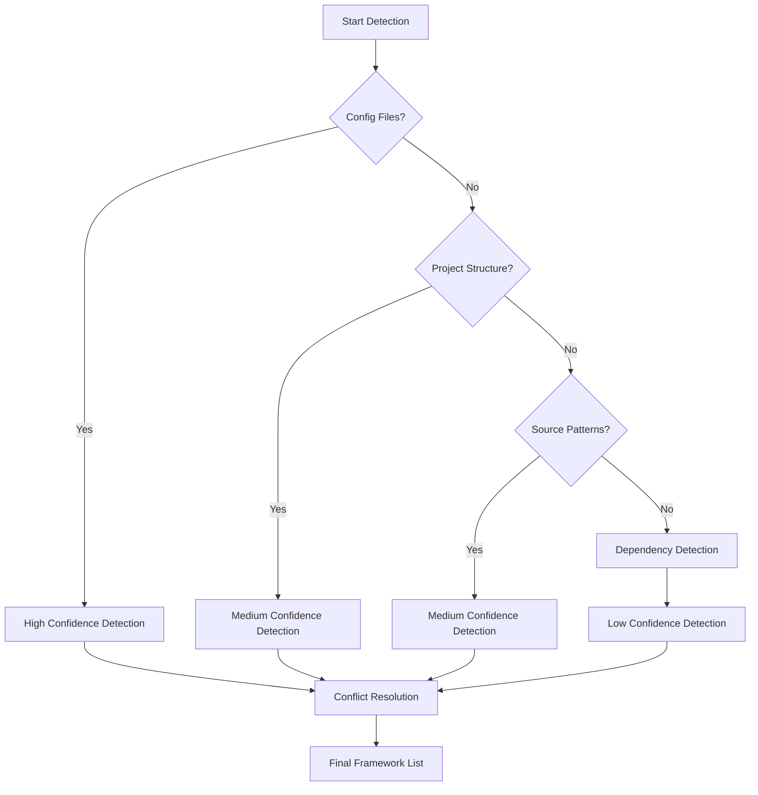

# JavaScript Framework Detection Improvements

## Overview

This document outlines improvements to the JavaScript/TypeScript framework detection logic to reduce false positives, particularly for React Native, Expo, React, Next.js, and TanStack Start. The current implementation has issues with distinguishing between these frameworks, leading to incorrect detections.

## Current Issues

1. **False Positives**: The current dependency-based detection often misidentifies frameworks
2. **Overlap Confusion**: React, React Native, and Expo share many common dependencies
3. **Framework Conflicts**: No clear prioritization when multiple frameworks are detected
4. **Missing Context**: Detection doesn't consider project structure and configuration files

## Improved Detection Strategy

### 1. Detection Priority Order

To resolve conflicts and improve accuracy, we'll implement a detection priority order:

1. **Configuration Files** (Highest priority)
   - Expo: `app.json`, `app.config.js`, `app.config.ts`
   - Next.js: `next.config.js`, `next.config.ts`
   - TanStack Start: `app.config.ts`, `vite.config.ts` with TanStack plugins
   - React Native: `react-native.config.js`

2. **Project Structure** (Medium priority)
   - Expo: `App.js`/`App.tsx` with `expo` imports
   - Next.js: `pages/` or `app/` directory structure
   - TanStack Start: `app/routes/` directory structure
   - React Native: `android/` and `ios/` directories

3. **Dependencies** (Lowest priority, fallback)
   - Use dependencies as supporting evidence rather than primary detection

### 2. Framework-Specific Detection Logic

#### React Native Detection

**Clear Indicators:**
- Dependency on `react-native`
- Presence of `android/` and `ios/` directories
- `react-native.config.js` file
- Entry point files with `import { AppRegistry } from 'react-native'`

**Differentiators from Expo:**
- No `app.json` or `app.config.*` files
- No `expo` dependency
- No `Expo` imports in source files

#### Expo Detection

**Clear Indicators:**
- Dependency on `expo`
- Presence of `app.json` or `app.config.*` files
- `Expo` imports in source files
- Entry point files with `registerRootComponent`

**Differentiators from React Native:**
- Has `app.json` or `app.config.*` configuration files
- Direct `expo` imports in source code
- Uses `expo-*` packages

#### React Detection

**Clear Indicators:**
- Dependency on `react` and `react-dom`
- No meta-framework dependencies
- No mobile-specific dependencies

**Differentiators:**
- Absence of Next.js, React Router, or other meta-framework dependencies
- No mobile-specific configuration or dependencies

#### Next.js Detection

**Clear Indicators:**
- Dependency on `next`
- Presence of `next.config.js` or `next.config.ts`
- `pages/` or `app/` directory structure
- Next.js specific imports (`next/router`, `next/link`)

**Differentiators:**
- Has `next.config.*` file
- Uses Next.js specific APIs
- Has `pages/` or `app/` directory structure

#### TanStack Start Detection

**Clear Indicators:**
- Dependency on `@tanstack/react-start`
- Presence of `app.config.ts` with TanStack configuration
- `app/routes/` directory structure
- Uses `createFileRoute`, `createRootRoute` APIs

**Differentiators:**
- Has `app/routes/` directory structure
- Uses TanStack Router APIs (`createFileRoute`)
- Has `app.config.ts` with TanStack configuration

#### React Router v7 Detection

**Clear Indicators:**
- Dependency on `react-router` and `react-router-dom`
- Uses React Router APIs (`createBrowserRouter`, `RouterProvider`)
- No meta-framework dependencies

**Differentiators:**
- No `next`, `@tanstack/react-start`, or other meta-framework dependencies
- Uses React Router specific APIs

## Implementation Plan

### 1. Enhanced File-Based Detection

We'll implement a new detection function that analyzes project files:

```rust
fn detect_frameworks_from_files(language: &DetectedLanguage) -> Vec<DetectedTechnology> {
    let mut detected = Vec::new();
    
    // Check for configuration files
    if has_expo_config_files(language) {
        detected.push(create_expo_detection());
    } else if has_nextjs_config_files(language) {
        detected.push(create_nextjs_detection());
    } else if has_tanstack_start_config(language) {
        detected.push(create_tanstack_start_detection());
    }
    
    // Check project structure
    if has_expo_project_structure(language) && !has_expo_config_files(language) {
        // Lower confidence as it's less definitive
        detected.push(create_expo_detection_with_lower_confidence());
    } else if has_nextjs_project_structure(language) && !has_nextjs_config_files(language) {
        detected.push(create_nextjs_detection_with_lower_confidence());
    }
    
    // Check source code patterns
    for file_path in &language.files {
        if let Ok(content) = fs::read_to_string(file_path) {
            if is_expo_source_file(&content) && !has_expo_config_files(language) {
                detected.push(create_expo_detection_with_medium_confidence());
            } else if is_nextjs_source_file(&content) && !has_nextjs_config_files(language) {
                detected.push(create_nextjs_detection_with_medium_confidence());
            }
        }
    }
    
    detected
}
```

### 2. Conflict Resolution

We'll implement a conflict resolution mechanism that prioritizes detections:

1. **Configuration File Detections** > **Project Structure Detections** > **Dependency Detections**
2. When conflicts arise, use confidence scores to determine the winner
3. Apply explicit conflict rules from existing TechnologyRule definitions

### 3. Confidence Scoring Improvements

Current confidence scoring will be enhanced with:

- Configuration file presence: +0.4
- Project structure match: +0.3
- Source code patterns: +0.2
- Dependency matches: +0.1 (reduced from current levels)

## Technical Implementation

### 1. Update Main Detection Function

We'll modify the main `detect_frameworks` function in `javascript.rs` to use our new multi-layered approach:

```rust
impl LanguageFrameworkDetector for JavaScriptFrameworkDetector {
    fn detect_frameworks(&self, language: &DetectedLanguage) -> Result<Vec<DetectedTechnology>> {
        let mut technologies = Vec::new();
        
        // Layer 1: Configuration file detection (highest confidence)
        let config_detections = detect_by_config_files(&language.root_path, language);
        technologies.extend(config_detections);
        
        // Layer 2: Project structure detection (medium confidence)
        let structure_detections = detect_by_project_structure(&language.root_path, language);
        technologies.extend(structure_detections);
        
        // Layer 3: Source code pattern detection (medium confidence)
        let pattern_detections = detect_by_source_patterns(language);
        technologies.extend(pattern_detections);
        
        // Layer 4: Dependency-based detection (fallback, lowest confidence)
        let rules = get_js_technology_rules();
        let all_deps: Vec<String> = language.main_dependencies.iter()
            .chain(language.dev_dependencies.iter())
            .cloned()
            .collect();
        
        let dependency_detections = FrameworkDetectionUtils::detect_technologies_by_dependencies(
            &rules, &all_deps, language.confidence
        );
        technologies.extend(dependency_detections);
        
        // Resolve conflicts and deduplicate
        let resolved_technologies = resolve_framework_conflicts(technologies);
        
        Ok(resolved_technologies)
    }
    
    fn supported_languages(&self) -> Vec<&'static str> {
        vec!["JavaScript", "TypeScript", "JavaScript/TypeScript"]
    }
}

### 2. Conflict Resolution Implementation

We'll implement a conflict resolution function that prioritizes detections based on confidence scores and detection methods:

```rust
/// Resolve conflicts between detected frameworks based on priority and confidence
fn resolve_framework_conflicts(mut technologies: Vec<DetectedTechnology>) -> Vec<DetectedTechnology> {
    // Sort by confidence (highest first)
    technologies.sort_by(|a, b| b.confidence.partial_cmp(&a.confidence).unwrap());
    
    let mut resolved = Vec::new();
    let mut seen_frameworks = std::collections::HashSet::new();
    
    for tech in technologies {
        // Check if this technology conflicts with already added technologies
        let has_conflict = resolved.iter().any(|resolved_tech| {
            tech.conflicts_with.contains(&resolved_tech.name) || 
            resolved_tech.conflicts_with.contains(&tech.name)
        });
        
        // Check if we've already added this framework type
        let is_duplicate = seen_frameworks.contains(&tech.name);
        
        if !has_conflict && !is_duplicate {
            resolved.push(tech.clone());
            seen_frameworks.insert(tech.name);
        }
    }
    
    resolved
}
```

### 3. New Detection Functions

We'll add the following functions to `javascript.rs`:

1. `detect_by_config_files()` - Check for framework-specific config files
2. `detect_by_project_structure()` - Analyze directory structure
3. `detect_by_source_patterns()` - Scan source files for framework-specific patterns
4. `resolve_framework_conflicts()` - Apply conflict resolution logic

Here are the detailed implementations:

```rust
/// Detect frameworks by looking for framework-specific configuration files
fn detect_by_config_files(root_path: &Path, language: &DetectedLanguage) -> Vec<DetectedTechnology> {
    let mut detected = Vec::new();
    
    // Check for Expo configuration files
    if root_path.join("app.json").exists() || 
       root_path.join("app.config.js").exists() || 
       root_path.join("app.config.ts").exists() {
        if language.main_dependencies.contains("expo") || language.dev_dependencies.contains("expo") {
            detected.push(DetectedTechnology {
                name: "Expo".to_string(),
                version: None,
                category: TechnologyCategory::MetaFramework,
                confidence: 0.95,
                requires: vec!["React Native".to_string()],
                conflicts_with: vec!["Next.js".to_string(), "React Router v7".to_string(), "SvelteKit".to_string(), "Nuxt.js".to_string(), "Tanstack Start".to_string()],
                is_primary: true,
            });
        }
    }
    
    // Check for Next.js configuration files
    if root_path.join("next.config.js").exists() || root_path.join("next.config.ts").exists() {
        if language.main_dependencies.contains("next") || language.dev_dependencies.contains("next") {
            detected.push(DetectedTechnology {
                name: "Next.js".to_string(),
                version: None,
                category: TechnologyCategory::MetaFramework,
                confidence: 0.95,
                requires: vec!["React".to_string()],
                conflicts_with: vec!["Expo".to_string(), "React Router v7".to_string(), "SvelteKit".to_string(), "Nuxt.js".to_string(), "Tanstack Start".to_string()],
                is_primary: true,
            });
        }
    }
    
    // Check for TanStack Start configuration
    if root_path.join("app.config.ts").exists() && 
       language.main_dependencies.contains("@tanstack/react-start") {
        detected.push(DetectedTechnology {
            name: "Tanstack Start".to_string(),
            version: None,
            category: TechnologyCategory::MetaFramework,
            confidence: 0.90,
            requires: vec!["React".to_string()],
            conflicts_with: vec!["Expo".to_string(), "Next.js".to_string(), "React Router v7".to_string(), "SvelteKit".to_string(), "Nuxt.js".to_string()],
            is_primary: true,
        });
    }
    
    detected
}

/// Detect frameworks by analyzing project directory structure
fn detect_by_project_structure(root_path: &Path, language: &DetectedLanguage) -> Vec<DetectedTechnology> {
    let mut detected = Vec::new();
    
    // Check for React Native project structure
    if root_path.join("android").exists() && root_path.join("ios").exists() &&
       (language.main_dependencies.contains("react-native") || language.dev_dependencies.contains("react-native")) {
        // Only detect as React Native if not already detected as Expo
        if !language.main_dependencies.contains("expo") && !language.dev_dependencies.contains("expo") {
            detected.push(DetectedTechnology {
                name: "React Native".to_string(),
                version: None,
                category: TechnologyCategory::FrontendFramework,
                confidence: 0.80,
                requires: vec!["React".to_string()],
                conflicts_with: vec!["Next.js".to_string(), "React Router v7".to_string(), "SvelteKit".to_string(), "Nuxt.js".to_string(), "Tanstack Start".to_string()],
                is_primary: true,
            });
        }
    }
    
    // Check for Next.js project structure
    if (root_path.join("pages").exists() || root_path.join("app").exists()) &&
       !root_path.join("next.config.js").exists() && !root_path.join("next.config.ts").exists() {
        // Lower confidence since we're inferring from directory structure
        if language.main_dependencies.contains("next") || language.dev_dependencies.contains("next") {
            detected.push(DetectedTechnology {
                name: "Next.js".to_string(),
                version: None,
                category: TechnologyCategory::MetaFramework,
                confidence: 0.70,
                requires: vec!["React".to_string()],
                conflicts_with: vec!["Expo".to_string(), "React Router v7".to_string(), "SvelteKit".to_string(), "Nuxt.js".to_string(), "Tanstack Start".to_string()],
                is_primary: true,
            });
        }
    }
    
    // Check for TanStack Start project structure
    if root_path.join("app").join("routes").exists() &&
       !root_path.join("app.config.ts").exists() {
        // Lower confidence since we're inferring from directory structure
        if language.main_dependencies.contains("@tanstack/react-start") || language.dev_dependencies.contains("@tanstack/react-start") {
            detected.push(DetectedTechnology {
                name: "Tanstack Start".to_string(),
                version: None,
                category: TechnologyCategory::MetaFramework,
                confidence: 0.70,
                requires: vec!["React".to_string()],
                conflicts_with: vec!["Expo".to_string(), "Next.js".to_string(), "React Router v7".to_string(), "SvelteKit".to_string(), "Nuxt.js".to_string()],
                is_primary: true,
            });
        }
    }
    
    detected
}

/// Detect frameworks by scanning source code for specific patterns
fn detect_by_source_patterns(language: &DetectedLanguage) -> Vec<DetectedTechnology> {
    let mut detected = Vec::new();
    
    for file_path in &language.files {
        if let Ok(content) = std::fs::read_to_string(file_path) {
            // Check for Expo-specific imports
            if content.contains("from 'expo'") || content.contains("import { registerRootComponent }") {
                detected.push(DetectedTechnology {
                    name: "Expo".to_string(),
                    version: None,
                    category: TechnologyCategory::MetaFramework,
                    confidence: 0.85,
                    requires: vec!["React Native".to_string()],
                    conflicts_with: vec!["Next.js".to_string(), "React Router v7".to_string(), "SvelteKit".to_string(), "Nuxt.js".to_string(), "Tanstack Start".to_string()],
                    is_primary: true,
                });
            }
            
            // Check for Next.js-specific imports
            if content.contains("from 'next'") || 
               content.contains("from 'next/router'") || 
               content.contains("from 'next/link'") {
                detected.push(DetectedTechnology {
                    name: "Next.js".to_string(),
                    version: None,
                    category: TechnologyCategory::MetaFramework,
                    confidence: 0.85,
                    requires: vec!["React".to_string()],
                    conflicts_with: vec!["Expo".to_string(), "React Router v7".to_string(), "SvelteKit".to_string(), "Nuxt.js".to_string(), "Tanstack Start".to_string()],
                    is_primary: true,
                });
            }
            
            // Check for TanStack Router patterns
            if content.contains("from '@tanstack/react-router'") || 
               content.contains("createFileRoute") || 
               content.contains("createRootRoute") {
                detected.push(DetectedTechnology {
                    name: "Tanstack Start".to_string(),
                    version: None,
                    category: TechnologyCategory::MetaFramework,
                    confidence: 0.80,
                    requires: vec!["React".to_string()],
                    conflicts_with: vec!["Expo".to_string(), "Next.js".to_string(), "React Router v7".to_string(), "SvelteKit".to_string(), "Nuxt.js".to_string()],
                    is_primary: true,
                });
            }
        }
    }
    
    detected
}
```

### 4. Enhanced Technology Rules

We'll update the technology rules to include file-based detection indicators:

```rust
/// Technology detection rule with enhanced file-based detection support
#[derive(Debug, Clone)]
pub struct TechnologyRule {
    pub name: String,
    pub category: TechnologyCategory,
    pub confidence: f32,
    pub dependency_patterns: Vec<String>,
    pub file_indicators: Vec<String>,
    pub requires: Vec<String>,
    pub conflicts_with: Vec<String>,
    pub is_primary_indicator: bool,
    pub alternative_names: Vec<String>,
}
```

We'll also update the existing rules to include file indicators:

Finally, we'll enhance the `FrameworkDetectionUtils` to support file-based detection:

```rust
// Enhanced Expo rule with file indicators
TechnologyRule {
    name: "Expo".to_string(),
    category: TechnologyCategory::MetaFramework,
    confidence: 0.98,
    dependency_patterns: vec!["expo".to_string(), "expo-router".to_string()],
    file_indicators: vec!["app.json".to_string(), "app.config.js".to_string(), "app.config.ts".to_string()],
    requires: vec!["React Native".to_string()],
    conflicts_with: vec!["Next.js".to_string(), "React Router v7".to_string(), "SvelteKit".to_string(), "Nuxt.js".to_string(), "Tanstack Start".to_string()],
    is_primary_indicator: true,
    alternative_names: vec![],
},

// Enhanced Next.js rule with file indicators
TechnologyRule {
    name: "Next.js".to_string(),
    category: TechnologyCategory::MetaFramework,
    confidence: 0.95,
    dependency_patterns: vec!["next".to_string()],
    file_indicators: vec!["next.config.js".to_string(), "next.config.ts".to_string()],
    requires: vec!["React".to_string()],
    conflicts_with: vec!["Expo".to_string(), "React Router v7".to_string(), "SvelteKit".to_string(), "Nuxt.js".to_string(), "Tanstack Start".to_string()],
    is_primary_indicator: true,
    alternative_names: vec!["nextjs".to_string()],
},
```

### 3. Detection Algorithm Flow

1. **Primary Detection**: Configuration files (highest confidence)
2. **Secondary Detection**: Project structure analysis
3. **Tertiary Detection**: Source code pattern matching
4. **Fallback Detection**: Dependency-based detection (current method)
5. **Conflict Resolution**: Apply priority rules and confidence scoring



```rust
impl FrameworkDetectionUtils {
    /// Detect technologies by checking for framework-specific files
    pub fn detect_technologies_by_files(
        rules: &[TechnologyRule], 
        root_path: &Path
    ) -> Vec<DetectedTechnology> {
        let mut detected = Vec::new();
        
        for rule in rules {
            for file_indicator in &rule.file_indicators {
                if root_path.join(file_indicator).exists() {
                    // Found a file indicator, create detection with higher confidence
                    let confidence = (rule.confidence + 0.2).min(1.0); // Boost confidence for file detection
                    
                    detected.push(DetectedTechnology {
                        name: rule.name.clone(),
                        version: None,
                        category: rule.category.clone(),
                        confidence,
                        requires: rule.requires.clone(),
                        conflicts_with: rule.conflicts_with.clone(),
                        is_primary: rule.is_primary_indicator,
                    });
                    
                    // Break to avoid multiple detections for the same technology
                    break;
                }
            }
        }
        
        detected
    }
}
```

## Expected Improvements

1. **Reduced False Positives**: By prioritizing file-based detection over dependencies
2. **Better Differentiation**: Clear rules for distinguishing similar frameworks
3. **Higher Accuracy**: Multi-layered detection approach
4. **Improved Confidence**: More accurate confidence scoring based on detection method

## Testing Strategy

1. **Unit Tests**: Test each detection function with mock project structures
2. **Integration Tests**: Test complete detection pipeline with real project examples
3. **Edge Case Testing**: Test projects with mixed dependencies and configurations
4. **Performance Testing**: Ensure detection doesn't significantly impact analysis time

### Test Cases

We'll create specific test cases for each framework:

1. **Expo Project**: Contains `app.json`, `expo` dependency, no `next` dependency
2. **React Native Project**: Contains `react-native` dependency, `android/` and `ios/` directories, no Expo files
3. **Next.js Project**: Contains `next.config.js`, `next` dependency, no Expo files
4. **TanStack Start Project**: Contains `app.config.ts` with TanStack config, `@tanstack/react-start` dependency
5. **React Router v7 Project**: Contains `react-router` and `react-router-dom` dependencies, no meta-framework dependencies
6. **Plain React Project**: Contains only `react` and `react-dom` dependencies
7. **Mixed Project**: Contains dependencies for multiple frameworks to test conflict resolution

Each test case will verify that:
- The correct framework is detected
- Confidence scores are appropriate for the detection method
- Conflicts are properly resolved
- No false positives are generated

## Rollout Plan

1. **Phase 1**: Implement file-based detection functions
2. **Phase 2**: Update conflict resolution logic
3. **Phase 3**: Enhance confidence scoring
4. **Phase 4**: Add comprehensive tests
5. **Phase 5**: Gradual rollout with monitoring for false positives

## Conclusion

This improved detection strategy will significantly reduce false positives by implementing a multi-layered approach that prioritizes configuration files and project structure over dependencies. The enhanced conflict resolution and confidence scoring will ensure more accurate framework detection for JavaScript/TypeScript projects.