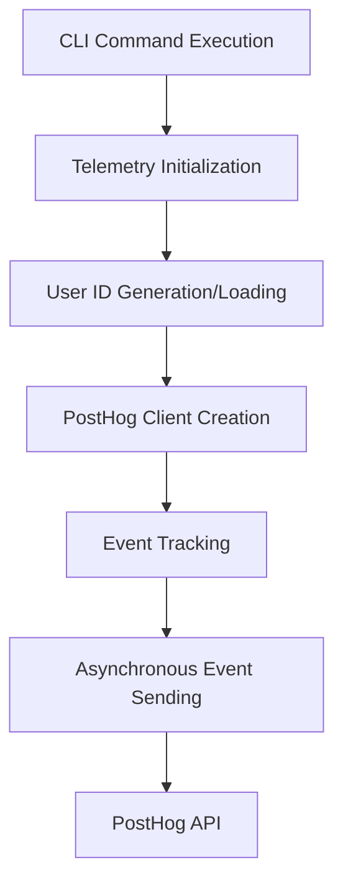

# PostHog Integration Design Document

## 1. Overview

This document outlines the design for integrating PostHog analytics into the Syncable CLI application. The integration will track usage of key commands (analyze, security, vulnerabilities) using the user's unique identifier generated during first use.

## 2. Current Implementation Analysis

The current telemetry implementation already includes:
- PostHog client initialization with API key
- User ID generation and persistence
- Event tracking for command start/complete and specific events
- Asynchronous event sending using tokio::spawn

However, there are some issues with the current implementation:
1. The API host is set to EU endpoint but should use US endpoint for the provided API key
2. The event tracking methods are using a non-standard API pattern rather than the recommended PostHog Rust SDK approach
3. Events are being sent with a `track` method that doesn't match the PostHog Rust SDK documentation

## 3. Architecture

### 3.1 Component Structure

```
src/telemetry/
├── client.rs      # Telemetry client implementation with PostHog integration
├── config.rs      # Telemetry configuration
├── mod.rs         # Module exports and initialization
├── user.rs        # User ID generation and management
└── test.rs        # Telemetry tests
```

### 3.2 Data Flow



## 4. Implementation Details

### 4.1 PostHog Client Configuration

The PostHog client will be configured with:
- API Key: `phc_t5zrCHU3yiU52lcUfOP3SiCSxdhJcmB2I3m06dGTk2D`
- API Host: `https://us.i.posthog.com` (US endpoint as required for this key)
- Asynchronous event sending using tokio

### 4.2 Event Structure

All events will include the following properties:
- `distinct_id`: User's unique identifier
- `personal_id`: Random number for privacy-preserving tracking
- `version`: CLI version from `CARGO_PKG_VERSION`
- `os`: Operating system from `std::env::consts::OS`

### 4.3 Tracked Events

1. **Command Start Event**
   - Event Name: `command_start`
   - Properties: `command` (command name)

2. **Command Complete Event**
   - Event Name: `command_complete`
   - Properties: `command`, `duration_ms`, `success`

3. **Specific Feature Events**
   - Event Name: `Security Scan`
   - Event Name: `Analyze Folder`
   - Event Name: `Vulnerability Scan`

### 4.4 User Identification

Users will be identified by a UUID generated on first use and stored in:
- Path: `~/.config/syncable-cli/user_id`
- Format: JSON with `id` and `first_seen` fields

## 5. API Design

### 5.1 TelemetryClient Methods

```rust
impl TelemetryClient {
    pub fn new(config: &Config) -> Result<Self, Box<dyn std::error::Error>>
    pub fn track_command_start(&self, command: &str)
    pub fn track_command_complete(&self, command: &str, duration: Duration, success: bool)
    pub fn track_event(&self, name: &str, properties: HashMap<String, Value>)
    pub fn track_security_scan(&self)
    pub fn track_analyze_folder(&self)
    pub fn track_vulnerability_scan(&self)
}
```

### 5.2 Event Creation Pattern

```rust
let mut event = Event::new("event_name", "distinct_id");
event.insert_prop("property_key", "property_value")?;
client.capture(event)?;
```

## 5. PostHog Rust SDK Usage

### 5.1 Client Initialization

Following the PostHog Rust SDK documentation, the client will be initialized as:

```rust
let client = posthog_rs::client("API_KEY")
    .host("https://us.i.posthog.com")
    .build()?;
```

### 5.2 Event Creation

Events will be created and sent using the SDK's recommended approach:

```rust
let mut event = posthog_rs::Event::new("event_name", "distinct_id");
event.insert_prop("key", "value")?;
client.capture(event)?;
```

### 5.3 Required Implementation Changes

The current implementation needs to be updated to match the PostHog Rust SDK:

1. Change the API endpoint from `https://eu.i.posthog.com` to `https://us.i.posthog.com`
2. Replace the non-standard `track` method with the proper `capture` method
3. Create `Event` objects properly using the SDK's API
4. Ensure all event properties are added using `insert_prop` method

### 5.4 Implementation Plan

The implementation will involve the following steps:

1. Update the `POSTHOG_API_HOST` constant to use the US endpoint
2. Modify all event tracking methods to use the proper PostHog Rust SDK API
3. Replace HashMap-based properties with direct `insert_prop` calls on Event objects
4. Change from `client.track()` to `client.capture()`
5. Ensure all event sending is properly asynchronous

### 5.5 Code Implementation Details

For each event tracking method, the implementation should follow this pattern:

```rust
let client = Arc::clone(&self.client);
let mut event = Event::new(event_name, &self.user_id.id);
// Add properties using insert_prop
// event.insert_prop("key", value)?;

// Send the event asynchronously
tokio::spawn(async move {
    match client.capture(event) {
        Ok(_) => log::debug!("Successfully sent telemetry event: {}", event_name),
        Err(e) => log::warn!("Failed to send telemetry event '{}': {}", event_name, e),
    }
});
```

### 5.6 Asynchronous Operations

All event sending will be performed asynchronously using `tokio::spawn` to avoid blocking the main application flow.

## 6. Integration Points

### 6.1 Main Application Integration

The telemetry client is initialized in `main.rs` during application startup:
- Called in the `run()` function before command execution
- Events tracked at command start and completion
- Specific events tracked in command handlers

### 6.2 Command-Specific Tracking

1. **Analyze Command**
   - Tracks `Analyze Folder` event in `handle_analyze`

2. **Security Command**
   - Tracks `Security Scan` event in `handle_security`

3. **Vulnerabilities Command**
   - Tracks `Vulnerability Scan` event in `handle_vulnerabilities`

## 7. Privacy and Compliance

### 7.1 Data Collection
- Only anonymous usage data is collected
- No personally identifiable information (PII) is sent
- User identification is through randomly generated UUIDs

### 7.2 Opt-Out Mechanism
- Users can disable telemetry through:
  - `--disable-telemetry` CLI flag
  - `SYNCABLE_CLI_TELEMETRY=false` environment variable
  - Configuration file setting

## 8. Testing Strategy

### 8.1 Unit Tests
- Test user ID generation and persistence
- Test PostHog client creation
- Test event property generation

### 8.2 Integration Tests
- Verify events are sent to PostHog API
- Test opt-out mechanisms
- Validate event structure and content

### 8.3 Implementation Verification
- Verify that all three required events (`Security Scan`, `Analyze Folder`, `Vulnerability Scan`) are properly sent
- Confirm that `distinct_id` is correctly set to the user's unique identifier
- Ensure `personal_id` is included in all events for privacy-preserving tracking
- Validate that events are sent asynchronously without blocking the main application

## 9. Error Handling

### 9.1 Client Initialization Failures
- Log warning and continue without telemetry
- Don't crash the application

### 9.2 Event Sending Failures
- Log warning for failed event sends
- Continue with command execution
- No retries or persistence of failed events

### 9.3 Event Creation Failures
- Handle `insert_prop` errors gracefully
- Log warnings for property insertion failures
- Continue with event sending even if some properties fail to insert

## 10. Performance Considerations

### 10.1 Asynchronous Operations
- All event sending happens asynchronously
- No blocking of main command execution
- Uses tokio::spawn for background tasks

### 10.2 Resource Management
- Single PostHog client instance per application run
- Shared through static OnceLock
- Automatic cleanup when application exits