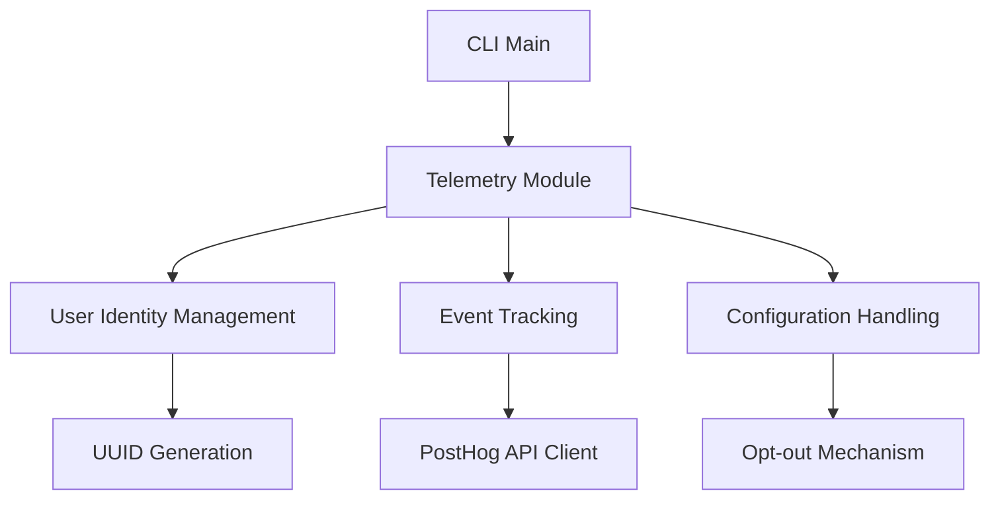

# PostHog Telemetry Integration Design Document

## 1. Overview

This document outlines the design for integrating PostHog telemetry into the syncable-cli tool to track usage patterns, command execution, and user behavior. The integration will help understand how users interact with the CLI, which features are most used, and identify areas for improvement.

### 1.1 Objectives
- Track unique installations and usage patterns
- Monitor command execution frequency and performance
- Enable data-driven decisions for feature development
- Provide opt-out mechanism for privacy-conscious users
- Implement a flexible telemetry framework for future expansion

### 1.2 Requirements
- Generate unique user identifiers for tracking
- Send telemetry events for command executions
- Implement opt-out functionality via configuration
- Ensure minimal performance impact on CLI operations
- Follow privacy best practices and data protection regulations

## 2. Architecture

### 2.1 Component Structure
The telemetry system will be implemented as a modular component with the following structure:



### 2.2 Key Components

#### 2.2.1 Telemetry Module
- Central component managing all telemetry functionality
- Handles initialization, configuration, and event dispatching
- Provides a clean API for other components to send events

#### 2.2.2 User Identity Management
- Generates and persists unique user identifiers
- Manages user sessions and identity across CLI invocations
- Ensures consistent tracking while respecting privacy

#### 2.2.3 Event Tracking
- Captures command execution events
- Formats events according to PostHog API requirements
- Handles batching and error recovery for event sending

#### 2.2.4 Configuration Handling
- Manages telemetry settings (enabled/disabled)
- Integrates with existing configuration system
- Provides opt-out functionality

## 3. Implementation Details

### 3.1 User Identification

#### 3.1.1 Unique User ID Generation
- Generate a UUID v4 identifier for each new installation
- Store the identifier in a user-specific configuration directory
- Reuse the identifier on subsequent CLI executions

#### 3.1.2 Storage Location
- Linux: `~/.config/syncable-cli/user_id`
- macOS: `~/Library/Application Support/syncable-cli/user_id`
- Windows: `%APPDATA%\syncable-cli\user_id`

### 3.2 Event Tracking

#### 3.2.1 Core Events
- Command execution start and completion
- Command execution duration
- Error occurrences
- Feature usage tracking

#### 3.2.2 Event Properties
Each event will include the following properties:
- `distinct_id`: User's unique identifier
- `command`: The executed command name
- `version`: CLI version
- `os`: Operating system information
- `duration`: Execution time (for completion events)
- `success`: Boolean indicating success/failure

### 3.3 PostHog API Integration

#### 3.3.1 API Endpoint
- URL: `https://eu.i.posthog.com/capture/`
- Method: POST
- Content-Type: application/json

#### 3.3.2 Request Format
```json
{
  "api_key": "phc_t5zrCHU3yiU52lcUfOP3SiCSxdhJcmB2I3m06dGTk2D",
  "event": "[event name]",
  "properties": {
    "distinct_id": "[user's distinct id]",
    "key1": "value1",
    "key2": "value2"
  },
  "timestamp": "[optional timestamp in ISO 8601 format]"
}
```

### 3.4 Opt-out Mechanism

#### 3.4.1 Configuration Option
Add a telemetry setting to the configuration file:
```toml
[telemetry]
enabled = true
```

#### 3.4.2 Environment Variable Override
Support disabling telemetry via environment variable:
```bash
SYNCABLE_CLI_TELEMETRY=false sync-ctl analyze .
```

## 4. Data Models

### 4.1 Telemetry Configuration
```rust
pub struct TelemetryConfig {
    pub enabled: bool,
    pub user_id: Option<String>,
}
```

### 4.2 Event Structure
```rust
pub struct TelemetryEvent {
    pub name: String,
    pub properties: HashMap<String, serde_json::Value>,
    pub timestamp: Option<DateTime<Utc>>,
}
```

### 4.3 User Identity
```rust
pub struct UserId {
    pub id: String,
    pub first_seen: DateTime<Utc>,
}
```

## 5. Integration Points

### 5.1 CLI Initialization
- Initialize telemetry module during CLI startup
- Load or generate user identifier
- Check telemetry configuration/opt-out settings

### 5.2 Command Execution Tracking
- Track command start with event properties
- Track command completion with duration and result
- Handle error cases appropriately

### 5.3 Configuration Integration
- Add telemetry settings to existing configuration system
- Provide CLI options for managing telemetry preferences

## 6. Privacy and Compliance

### 6.1 Data Collection Principles
- Collect only anonymous usage data
- Never collect sensitive user data or project information
- Provide clear opt-out mechanism
- Minimize data retention period

### 6.2 GDPR Compliance
- Treat user ID as pseudonymized data
- Allow users to request data deletion
- Document data processing activities
- Implement data minimization practices

## 7. Performance Considerations

### 7.1 Asynchronous Event Sending
- Send events asynchronously to avoid blocking CLI operations
- Use background threads for network operations
- Implement retry logic with exponential backoff

### 7.2 Caching and Batching
- Cache events in memory for batch sending
- Limit memory usage for cached events
- Send batches periodically or when reaching threshold

## 8. Error Handling

### 8.1 Network Failures
- Log network errors without interrupting CLI operation
- Implement retry mechanism for failed event sends
- Discard events that consistently fail to send

## 12. Telemetry Module API

### 12.1 Public Interface
```rust
/// Initialize the telemetry module
pub fn init(config: &Config) -> Result<TelemetryClient>;

/// Record a command execution start event
pub fn track_command_start(command: &str);

/// Record a command execution completion event
pub fn track_command_complete(command: &str, duration: Duration, success: bool);

/// Record a custom event
pub fn track_event(name: &str, properties: HashMap<String, serde_json::Value>);

/// Flush any pending events
pub fn flush();
```

### 12.2 Usage Examples
```rust
// Initialize telemetry
let telemetry = TelemetryClient::init(&config)?;

// Track command start
telemetry.track_command_start("analyze");

// Track command completion
telemetry.track_command_complete("analyze", duration, true);

// Track custom events
let mut props = HashMap::new();
props.insert("feature".to_string(), serde_json::Value::String("dockerfile".to_string()));
telemetry.track_event("feature_used", props);
```

### 8.2 Configuration Errors
- Gracefully handle missing or invalid configuration
- Fall back to default settings when needed
- Provide clear error messages for configuration issues

## 9. Testing Strategy

### 9.1 Unit Tests
- Test user ID generation and persistence
- Verify event formatting and validation
- Test opt-out functionality
- Validate configuration handling

### 9.2 Integration Tests
- Test PostHog API integration with mock server
- Verify event sending under various network conditions
- Test telemetry behavior with different configuration settings

### 9.3 Performance Tests
- Measure impact of telemetry on CLI execution time
- Test event batching and caching mechanisms
- Validate resource usage under load

## 10. Implementation Plan

### 10.1 Phase 1: Core Infrastructure
1. Add `uuid` crate dependency to Cargo.toml
2. Create telemetry module structure in `src/telemetry/`
3. Implement user ID generation and persistence
4. Create PostHog API client
5. Implement configuration handling

### 10.2 Phase 2: Event Tracking
1. Integrate telemetry initialization in CLI main
2. Implement command execution tracking
3. Add event properties collection
4. Implement asynchronous event sending

### 10.3 Phase 3: Opt-out and Configuration
1. Add telemetry configuration to existing config system
2. Implement opt-out via configuration file
3. Add environment variable override
4. Update documentation

### 10.4 Phase 4: Testing and Refinement
1. Write unit tests for all telemetry components
2. Create integration tests with mock PostHog server
3. Perform performance testing
4. Refine implementation based on test results

## 11. Dependencies and Configuration

### 11.1 New Dependencies
- `uuid = { version = "1.0", features = ["v4"] }` - For generating unique user identifiers
- `reqwest = { version = "0.11", features = ["json"] }` - For HTTP requests to PostHog API (already in use)
- `tokio = { version = "1", features = ["rt"] }` - For asynchronous operations (already in use)
- `serde_json = "1.0"` - For JSON serialization (already in use)

### 11.2 Configuration Changes
Update the `Config` struct in `src/config/types.rs` to include telemetry settings:

```rust
#[derive(Debug, Clone, Serialize, Deserialize)]
pub struct Config {
    pub analysis: AnalysisConfig,
    pub generation: GenerationConfig,
    pub output: OutputConfig,
    pub telemetry: TelemetryConfig,  // New field
}

#[derive(Debug, Clone, Serialize, Deserialize)]
pub struct TelemetryConfig {
    pub enabled: bool,
}
```

Default configuration:
```rust
impl Default for Config {
    fn default() -> Self {
        Self {
            analysis: AnalysisConfig::default(),
            generation: GenerationConfig::default(),
            output: OutputConfig::default(),
            telemetry: TelemetryConfig {
                enabled: true,  // Telemetry enabled by default
            },
        }
    }
}
```

## 13. CLI Integration Points

### 13.1 Main Entry Point Integration
In `src/main.rs`, initialize telemetry after configuration loading:

```rust
// After config loading
let telemetry = if config.telemetry.enabled && std::env::var("SYNCABLE_CLI_TELEMETRY").unwrap_or_default() != "false" {
    Some(TelemetryClient::init(&config).unwrap_or_default())
} else {
    None
};

// Record command start
if let Some(ref t) = telemetry {
    t.track_command_start(command_name);
}

// Record command completion
if let Some(ref t) = telemetry {
    t.track_command_complete(command_name, duration, success);
}
```

### 13.2 New CLI Options
Add a new global option to control telemetry:

```rust
/// Disable telemetry data collection
#[arg(long, global = true)]
pub disable_telemetry: bool,
```

This option will override the configuration file setting and disable telemetry for that specific execution.

## 14. Privacy Notice and Documentation

### 14.1 Privacy Notice
Add a privacy notice to the README and documentation:

> **Telemetry Notice**: Syncable CLI collects anonymous usage data to help us improve the product. This data includes command execution, feature usage, and performance metrics. No personal or project-specific data is collected. You can opt out at any time by setting `telemetry.enabled = false` in your configuration file or using the `--disable-telemetry` flag.

### 14.2 Documentation Updates
- Update README.md with telemetry information
- Add section to CLI help text
- Document configuration options
- Create privacy policy document
- Update installation guides to mention telemetry