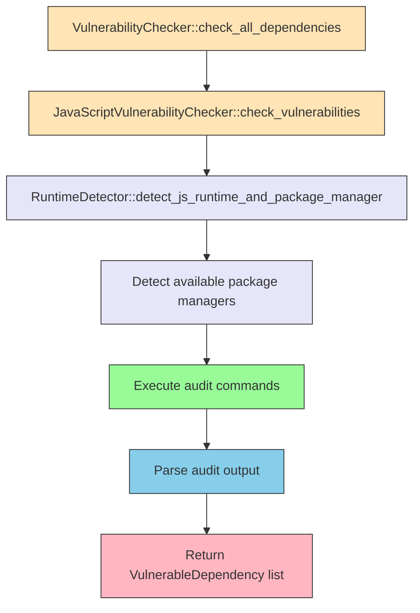
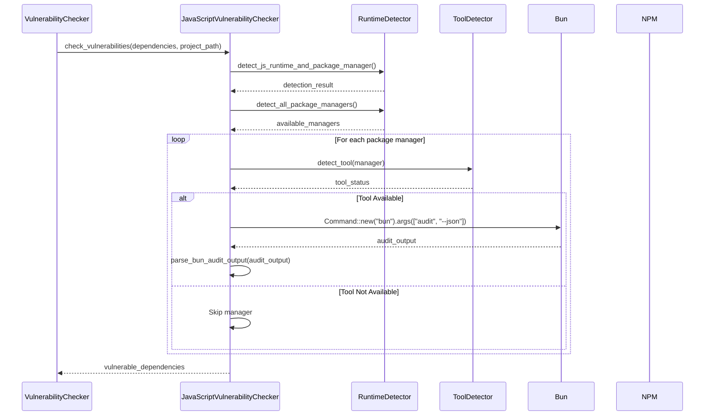

# Vulnerability Scanning Fix for JavaScript Projects

## Table of Contents

1. [Overview](#overview)
2. [Architecture](#architecture)
3. [Implementation Plan](#implementation-plan)
4. [Command Execution Flow](#command-execution-flow)
5. [Error Handling](#error-handling)
6. [Testing Strategy](#testing-strategy)
7. [Security Considerations](#security-considerations)
8. [Performance Considerations](#performance-considerations)
9. [Dependencies](#dependencies)
10. [Rollout Plan](#rollout-plan)

## Overview

The current JavaScript vulnerability checker in syncable-cli is not properly implemented. It returns an empty result set instead of actually executing vulnerability scanning commands like `bun audit`, `npm audit`, etc. This causes the tool to report "No vulnerabilities found!" even when vulnerabilities exist in the project.

This design document outlines the fix to implement proper JavaScript vulnerability scanning by executing the appropriate audit commands based on detected package managers.



## Architecture

The vulnerability scanning system follows a modular architecture with language-specific checkers:

1. **VulnerabilityChecker** (core): Coordinates scanning across all languages
2. **LanguageVulnerabilityChecker** (trait): Defines interface for language-specific checkers
3. **JavaScriptVulnerabilityChecker** (implementation): Executes JavaScript package manager audit commands

The fix will enhance the JavaScriptVulnerabilityChecker to:
1. Detect available package managers in the project
2. Execute appropriate audit commands
3. Parse the output to identify vulnerabilities
4. Return structured vulnerability information

## Implementation Plan

### 1. Enhanced JavaScript Vulnerability Checker

The JavaScript vulnerability checker will be enhanced to actually execute audit commands:

```rust
impl LanguageVulnerabilityChecker for JavaScriptVulnerabilityChecker {
    fn check_vulnerabilities(
        &self,
        dependencies: &[DependencyInfo],
        project_path: &Path,
    ) -> Result<Vec<VulnerableDependency>, VulnerabilityError> {
        info!("Checking JavaScript/TypeScript dependencies");
        
        // Detect runtime and package manager
        let runtime_detector = RuntimeDetector::new(project_path.to_path_buf());
        let detection_result = runtime_detector.detect_js_runtime_and_package_manager();
        
        info!("Runtime detection: {}", runtime_detector.get_detection_summary());
        
        // Get all available package managers
        let available_managers = runtime_detector.detect_all_package_managers();
        
        // Execute audit commands for each available manager
        let mut all_vulnerabilities = Vec::new();
        
        for manager in available_managers {
            if let Some(vulns) = self.execute_audit_for_manager(&manager, project_path, dependencies)? {
                all_vulnerabilities.extend(vulns);
            }
        }
        
        Ok(all_vulnerabilities)
    }
}
```

### 2. Audit Command Execution

Implementation of command execution for each package manager:

```rust
fn execute_audit_for_manager(
    &self,
    manager: &PackageManager,
    project_path: &Path,
    dependencies: &[DependencyInfo],
) -> Result<Option<Vec<VulnerableDependency>>, VulnerabilityError> {
    match manager {
        PackageManager::Bun => self.execute_bun_audit(project_path, dependencies),
        PackageManager::Npm => self.execute_npm_audit(project_path, dependencies),
        PackageManager::Yarn => self.execute_yarn_audit(project_path, dependencies),
        PackageManager::Pnpm => self.execute_pnpm_audit(project_path, dependencies),
        PackageManager::Unknown => Ok(None),
    }
}

fn execute_bun_audit(
    &self,
    project_path: &Path,
    dependencies: &[DependencyInfo],
) -> Result<Option<Vec<VulnerableDependency>>, VulnerabilityError> {
    // Check if bun is available
    let mut detector = ToolDetector::new();
    if !detector.detect_tool("bun").available {
        warn!("bun not found, skipping bun audit");
        return Ok(None);
    }
    
    // Execute bun audit --json
    let output = Command::new("bun")
        .args(&["audit", "--json"])
        .current_dir(project_path)
        .output()
        .map_err(|e| VulnerabilityError::CommandError(
            format!("Failed to run bun audit: {}", e)
        ))?;
    
    if !output.status.success() {
        // bun audit returns non-zero exit code when vulnerabilities found
        // This is expected behavior, not an error
        info!("bun audit completed with findings");
    }
    
    if output.stdout.is_empty() {
        return Ok(None);
    }
    
    // Parse bun audit output
    let audit_data: serde_json::Value = serde_json::from_slice(&output.stdout)
        .map_err(|e| VulnerabilityError::ParseError(
            format!("Failed to parse bun audit output: {}", e)
        ))?;
    
    self.parse_bun_audit_output(&audit_data, dependencies)
}

// Similar implementations for npm, yarn, and pnpm
```

### 3. Output Parsing

Each package manager has different output formats that need to be parsed:

#### Bun Audit Output Parsing
Bun audit outputs JSON format which needs to be parsed to extract vulnerability information.

```rust
fn parse_bun_audit_output(
    &self,
    audit_data: &serde_json::Value,
    dependencies: &[DependencyInfo],
) -> Result<Option<Vec<VulnerableDependency>>, VulnerabilityError> {
    let mut vulnerable_deps: Vec<VulnerableDependency> = Vec::new();
    
    // Bun audit JSON structure parsing
    if let Some(advisories) = audit_data.get("advisories").and_then(|a| a.as_array()) {
        for advisory in advisories {
            // Extract vulnerability information
            let name = advisory.get("name").and_then(|n| n.as_str()).unwrap_or("").to_string();
            let version = advisory.get("version").and_then(|v| v.as_str()).unwrap_or("").to_string();
            
            let vuln_info = VulnerabilityInfo {
                id: advisory.get("id").and_then(|i| i.as_str()).unwrap_or("unknown").to_string(),
                severity: self.parse_severity(advisory.get("severity").and_then(|s| s.as_str())),
                title: advisory.get("title").and_then(|t| t.as_str()).unwrap_or("").to_string(),
                description: advisory.get("description").and_then(|d| d.as_str()).unwrap_or("").to_string(),
                cve: advisory.get("cve").and_then(|c| c.as_str()).map(|s| s.to_string()),
                ghsa: advisory.get("ghsa").and_then(|g| g.as_array())
                    .and_then(|arr| arr.first())
                    .and_then(|v| v.as_str())
                    .map(|s| s.to_string()),
                affected_versions: advisory.get("vulnerable_versions").and_then(|v| v.as_str()).unwrap_or("").to_string(),
                patched_versions: advisory.get("patched_versions").and_then(|p| p.as_str()).map(|s| s.to_string()),
                published_date: None, // Bun audit may not provide this
                references: advisory.get("references").and_then(|r| r.as_array())
                    .map(|refs| refs.iter()
                        .filter_map(|r| r.as_str().map(|s| s.to_string()))
                        .collect())
                    .unwrap_or_default(),
            };
            
            // Find matching dependency
            if let Some(dep) = dependencies.iter().find(|d| d.name == name) {
                // Check if we already have this dependency
                if let Some(existing) = vulnerable_deps.iter_mut()
                    .find(|vuln_dep| vuln_dep.name == name && vuln_dep.version == version)
                {
                    existing.vulnerabilities.push(vuln_info);
                } else {
                    vulnerable_deps.push(VulnerableDependency {
                        name: dep.name.clone(),
                        version: version.clone(),
                        language: Language::JavaScript,
                        vulnerabilities: vec![vuln_info],
                    });
                }
            }
        }
    }
    
    if vulnerable_deps.is_empty() {
        Ok(None)
    } else {
        Ok(Some(vulnerable_deps))
    }
}
```

#### NPM Audit Output Parsing
NPM audit can output in JSON format with `npm audit --json` which provides detailed vulnerability information.

#### Yarn Audit Output Parsing
Yarn audit outputs JSON format which needs to be parsed similarly.

#### PNPM Audit Output Parsing
PNPM audit also provides JSON output format for parsing.

## Data Models

### VulnerableDependency (existing)
```rust
pub struct VulnerableDependency {
    pub name: String,
    pub version: String,
    pub language: Language,
    pub vulnerabilities: Vec<VulnerabilityInfo>,
}
```

### VulnerabilityInfo (existing)
```rust
pub struct VulnerabilityInfo {
    pub id: String,
    pub severity: VulnerabilitySeverity,
    pub title: String,
    pub description: String,
    pub cve: Option<String>,
    pub ghsa: Option<String>,
    pub affected_versions: String,
    pub patched_versions: Option<String>,
    pub published_date: Option<DateTime<Utc>>,
    pub references: Vec<String>,
}
```

### Severity Parsing
```rust
fn parse_severity(&self, severity_str: Option<&str>) -> VulnerabilitySeverity {
    match severity_str.map(|s| s.to_lowercase()).as_deref() {
        Some("critical") => VulnerabilitySeverity::Critical,
        Some("high") => VulnerabilitySeverity::High,
        Some("moderate") => VulnerabilitySeverity::Medium,
        Some("medium") => VulnerabilitySeverity::Medium,
        Some("low") => VulnerabilitySeverity::Low,
        _ => VulnerabilitySeverity::Medium, // Default
    }
}
```

## Command Execution Flow



## Error Handling

The implementation will handle various error conditions:

1. **Command Not Found**: When a package manager is detected but not installed
2. **Execution Failures**: When audit commands fail to execute
3. **Parse Errors**: When output cannot be parsed as expected
4. **Network Issues**: For audit commands that require internet access

```rust
// Error handling example
fn execute_bun_audit(
    &self,
    project_path: &Path,
    dependencies: &[DependencyInfo],
) -> Result<Option<Vec<VulnerableDependency>>, VulnerabilityError> {
    // Check if bun is available
    let mut detector = ToolDetector::new();
    let tool_status = detector.detect_tool("bun");
    
    if !tool_status.available {
        warn!("bun not found, skipping bun audit. Install with: curl -fsSL https://bun.sh/install | bash");
        return Ok(None);
    }
    
    // Execute bun audit --json
    let output = Command::new("bun")
        .args(&["audit", "--json"])
        .current_dir(project_path)
        .output();
    
    match output {
        Ok(output) => {
            // Handle successful execution
            if output.stdout.is_empty() {
                return Ok(None);
            }
            
            // Parse output
            match serde_json::from_slice(&output.stdout) {
                Ok(audit_data) => self.parse_bun_audit_output(&audit_data, dependencies),
                Err(e) => Err(VulnerabilityError::ParseError(
                    format!("Failed to parse bun audit output: {}", e)
                )),
            }
        },
        Err(e) => {
            // Handle execution failure
            Err(VulnerabilityError::CommandError(
                format!("Failed to run bun audit: {}. Ensure bun is properly installed and in PATH.", e)
            ))
        }
    }
}
```

## Testing Strategy

### Unit Tests
- Test parsing of different audit command outputs
- Test error handling for various failure scenarios
- Test deduplication of vulnerabilities across package managers

### Integration Tests
- Test end-to-end workflow with actual projects
- Test with projects using different package managers
- Test with projects that have known vulnerabilities

```rust
#[cfg(test)]
mod tests {
    use super::*;
    use tempfile::TempDir;
    
    #[test]
    fn test_bun_audit_parsing() {
        let audit_output = r#"{"advisories": [{"name": "hono", "version": "4.8.0", "title": "Hono's flaw in URL path parsing could cause path confusion", "severity": "high"}]}"#;
        let audit_data: serde_json::Value = serde_json::from_str(audit_output).unwrap();
        
        let dependencies = vec![DependencyInfo {
            name: "hono".to_string(),
            version: "4.8.0".to_string(),
            language: Language::JavaScript,
            dependency_type: DependencyType::Production,
        }];
        
        let checker = JavaScriptVulnerabilityChecker::new();
        let result = checker.parse_bun_audit_output(&audit_data, &dependencies);
        
        assert!(result.is_ok());
        let vulnerabilities = result.unwrap();
        assert!(vulnerabilities.is_some());
        assert_eq!(vulnerabilities.unwrap().len(), 1);
    }
}
```

## Security Considerations

1. **Command Injection**: Ensure that package manager commands are executed safely without user input injection
2. **Output Sanitization**: Sanitize command output before processing
3. **Timeout Handling**: Implement timeouts for audit commands to prevent hanging
4. **Path Validation**: Validate that project paths are legitimate to prevent directory traversal attacks

```rust
// Path validation example
fn validate_project_path(project_path: &Path) -> Result<(), VulnerabilityError> {
    // Ensure path exists
    if !project_path.exists() {
        return Err(VulnerabilityError::CheckFailed(
            "Project path does not exist".to_string()
        ));
    }
    
    // Ensure path is a directory
    if !project_path.is_dir() {
        return Err(VulnerabilityError::CheckFailed(
            "Project path is not a directory".to_string()
        ));
    }
    
    Ok(())
}
```

## Performance Considerations

1. **Parallel Execution**: Execute audit commands for different package managers in parallel where possible
2. **Caching**: Cache results for a short period to avoid repeated scans
3. **Resource Limits**: Limit memory and CPU usage during scanning
4. **Timeouts**: Implement timeouts to prevent hanging commands

```rust
// Timeout implementation example
use std::time::Duration;
use std::process::Command;

fn execute_audit_with_timeout(
    command: &str,
    args: &[&str],
    project_path: &Path,
    timeout: Duration,
) -> Result<std::process::Output, VulnerabilityError> {
    let child = Command::new(command)
        .args(args)
        .current_dir(project_path)
        .spawn()
        .map_err(|e| VulnerabilityError::CommandError(
            format!("Failed to spawn {} command: {}", command, e)
        ))?;
    
    // Note: In a real implementation, we would use a proper timeout mechanism
    // This is a simplified example
    let output = child.wait_with_output()
        .map_err(|e| VulnerabilityError::CommandError(
            format!("Failed to wait for {} command: {}", command, e)
        ))?;
    
    Ok(output)
}
```

## Backward Compatibility

The implementation will maintain backward compatibility by:
1. Keeping the same public API for the JavaScriptVulnerabilityChecker
2. Maintaining the same return types and error types
3. Ensuring existing functionality continues to work

The only change visible to users will be that JavaScript vulnerability scanning now actually works instead of returning empty results.

## Dependencies

The implementation will leverage existing components:
1. **RuntimeDetector**: For detecting JavaScript runtimes and package managers
2. **ToolDetector**: For checking if package managers are installed
3. **Existing Vulnerability Data Models**: For representing vulnerability information

Additionally, the implementation will use:
- **std::process::Command**: For executing audit commands
- **serde_json**: For parsing JSON output from audit commands
- **log**: For logging information and warnings

## Rollout Plan

1. **Implementation**: Develop the enhanced JavaScript vulnerability checker
2. **Testing**: Thoroughly test with various JavaScript projects
3. **Documentation**: Update documentation with new capabilities
4. **Release**: Include in the next release of syncable-cli

## Example Usage

After implementation, the vulnerability scanning will work as expected:

```bash
# Before fix
$ sync-ctl vulnerabilities --severity low ../project
✅ No vulnerabilities found!

# After fix (with same project that has vulnerabilities)
$ sync-ctl vulnerabilities --severity low ../project

🛡️  Vulnerability Scan Report
================================================================================
hono  >=4.8.0 <4.9.6
  @voltagent/langfuse-exporter › @voltagent/core › @hono/zod-openapi › hono
  high: Hono's flaw in URL path parsing could cause path confusion - https://github.com/advisories/GHSA-9hp6-4448-45g2

1 vulnerabilities (1 high)
```