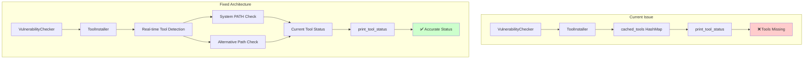
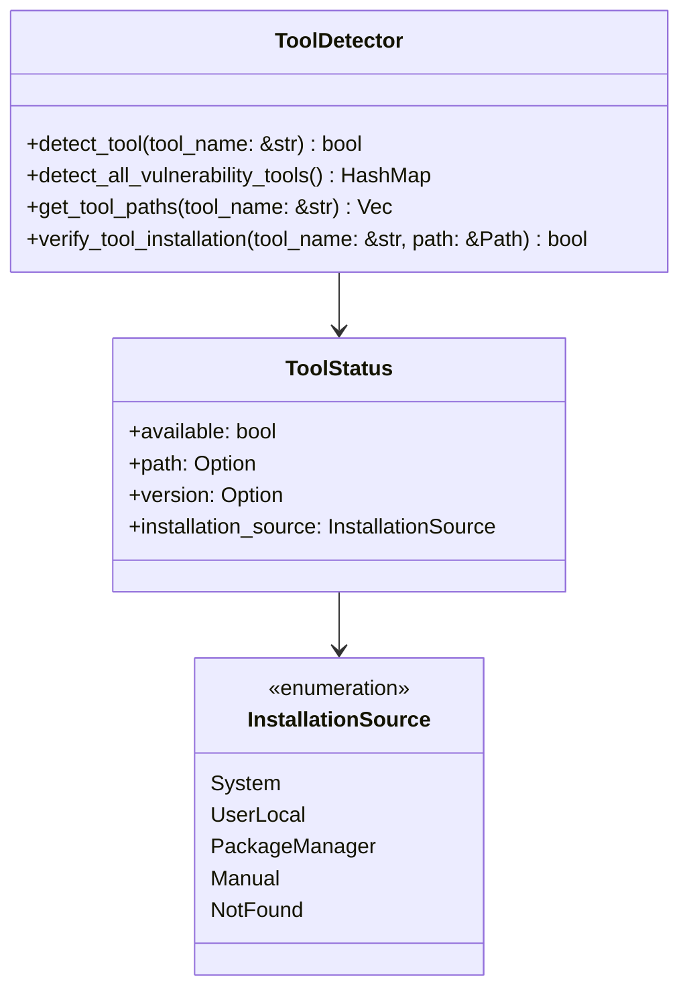

# Vulnerability Scanning Tool Detection and Setup Fix

## Overview

The vulnerability scanning functionality in Syncable CLI currently shows tools as "missing" even when they are properly installed on the system. This occurs because the tool detection mechanism relies on a cached state rather than performing real-time system checks. Users encounter false negatives where tools like `cargo-audit`, `npm audit`, `pip-audit`, etc. appear missing despite being available in the system PATH.

## Architecture

The current vulnerability scanning architecture consists of three main components that need improvement:



## Root Cause Analysis

### Issue 1: Cache-Only Tool Detection
The `print_tool_status` method in `ToolInstaller` only checks the `installed_tools` HashMap cache:

```rust
let (tool, status) = match language {
    Language::Rust => ("cargo-audit", self.installed_tools.get("cargo-audit").unwrap_or(&false)),
    // ...
};
```

**Problem**: The cache is only populated when tools are installed via the CLI, not when checking existing system installations.

### Issue 2: Incomplete System Detection  
The `is_tool_installed` method performs system checks but results aren't cached for display purposes:

```rust
fn is_tool_installed(&self, tool: &str) -> bool {
    // Check cache first - often empty
    if let Some(&cached) = self.installed_tools.get(tool) {
        return cached;
    }
    // Perform actual system check but don't cache result
    // ...
}
```

**Problem**: System detection results aren't stored for later display.

### Issue 3: Inconsistent Tool Detection Logic
Different vulnerability scanning functions have their own tool detection logic, leading to inconsistent behavior across the codebase.

## Solution Design

### Component 1: Enhanced Tool Detection System

Create a comprehensive tool detection system that:

1. **Real-time System Checks**: Always verify tool availability by executing version commands
2. **Multi-path Detection**: Check standard locations and alternative installation paths
3. **Cached Results**: Store detection results to avoid repeated system calls
4. **Status Reporting**: Provide detailed status information for user feedback



### Component 2: Improved VulnerabilityChecker Integration

Update the vulnerability checker to use the enhanced detection system:

1. **Pre-scan Tool Detection**: Check all required tools before starting vulnerability scans
2. **Graceful Degradation**: Continue with available tools when some are missing
3. **Clear User Guidance**: Provide specific installation instructions for missing tools

### Component 3: Enhanced Status Reporting

Improve the tool status display to show:

1. **Detailed Tool Information**: Version, installation path, and source
2. **Installation Guidance**: Specific commands for missing tools
3. **Alternative Options**: Suggest alternative scanners when primary tools are unavailable

```mermaid
graph TB
    subgraph "Enhanced Status Display"
        Check[Tool Detection] --> Available{Tool Available?}
        Available -->|Yes| Details[Show: ✅ Tool v1.0 (/usr/bin/tool)]
        Available -->|No| Missing[Show: ❌ Tool missing]
        Missing --> Guidance[Installation Instructions]
        Details --> Success[User Confidence]
        Guidance --> Install[User Can Install]
    end
```

## Implementation Plan

### Phase 1: Core Tool Detection Enhancement

1. **Create ToolDetector Module**
   - Implement comprehensive tool detection logic
   - Support for multiple installation paths
   - Version extraction and validation
   - Result caching with TTL

2. **Update ToolInstaller**
   - Replace cache-only logic with real-time detection
   - Integrate with new ToolDetector
   - Maintain backward compatibility

### Phase 2: VulnerabilityChecker Integration

1. **Pre-scan Validation**
   - Check tool availability before attempting scans
   - Provide early feedback on missing tools
   - Skip unavailable scanners gracefully

2. **Enhanced Error Handling**
   - Distinguish between tool missing vs tool execution failure
   - Provide context-specific error messages
   - Suggest alternative scanning approaches

### Phase 3: User Experience Improvements

1. **Detailed Status Reporting**
   - Show tool versions and installation paths
   - Provide platform-specific installation commands
   - Highlight successfully detected tools

2. **Setup Assistance**
   - Interactive tool installation guidance
   - Integration with existing install scripts
   - Verification of successful installations

## Technical Implementation Details

### Detailed Implementation Specifications

#### 1. ToolDetector Module Structure

```rust
use std::collections::HashMap;
use std::path::{Path, PathBuf};
use std::process::Command;
use std::time::{Duration, SystemTime};
use serde::{Deserialize, Serialize};

#[derive(Debug, Clone, Serialize, Deserialize)]
pub struct ToolStatus {
    pub available: bool,
    pub path: Option<PathBuf>,
    pub version: Option<String>,
    pub installation_source: InstallationSource,
    pub last_checked: SystemTime,
}

#[derive(Debug, Clone, Serialize, Deserialize)]
pub enum InstallationSource {
    SystemPath,
    UserLocal,
    CargoHome,
    GoHome,
    PackageManager(String), // brew, apt, etc.
    Manual,
    NotFound,
}

pub struct ToolDetector {
    cache: HashMap<String, ToolStatus>,
    cache_ttl: Duration,
}

impl ToolDetector {
    pub fn new() -> Self {
        Self {
            cache: HashMap::new(),
            cache_ttl: Duration::from_secs(300), // 5 minutes
        }
    }
    
    pub fn detect_tool(&mut self, tool_name: &str) -> ToolStatus {
        // Check cache first
        if let Some(cached) = self.cache.get(tool_name) {
            if cached.last_checked.elapsed().unwrap_or(Duration::MAX) < self.cache_ttl {
                return cached.clone();
            }
        }
        
        // Perform real detection
        let status = self.detect_tool_real_time(tool_name);
        self.cache.insert(tool_name.to_string(), status.clone());
        status
    }
    
    fn detect_tool_real_time(&self, tool_name: &str) -> ToolStatus {
        let search_paths = self.get_tool_search_paths(tool_name);
        
        // Try direct command first (in PATH)
        if let Some((path, version)) = self.try_command_in_path(tool_name) {
            return ToolStatus {
                available: true,
                path: Some(path),
                version,
                installation_source: InstallationSource::SystemPath,
                last_checked: SystemTime::now(),
            };
        }
        
        // Try alternative paths
        for search_path in search_paths {
            let tool_path = search_path.join(tool_name);
            if let Some(version) = self.verify_tool_at_path(&tool_path, tool_name) {
                let source = self.determine_installation_source(&search_path);
                return ToolStatus {
                    available: true,
                    path: Some(tool_path),
                    version,
                    installation_source: source,
                    last_checked: SystemTime::now(),
                };
            }
        }
        
        // Tool not found
        ToolStatus {
            available: false,
            path: None,
            version: None,
            installation_source: InstallationSource::NotFound,
            last_checked: SystemTime::now(),
        }
    }
    
    fn get_tool_search_paths(&self, tool_name: &str) -> Vec<PathBuf> {
        let mut paths = Vec::new();
        
        // User-specific paths
        if let Ok(home) = std::env::var("HOME") {
            let home_path = PathBuf::from(home);
            
            // Common user install locations
            paths.push(home_path.join(".local").join("bin"));
            paths.push(home_path.join(".cargo").join("bin"));
            paths.push(home_path.join("go").join("bin"));
            
            // Tool-specific locations
            match tool_name {
                "cargo-audit" => {
                    paths.push(home_path.join(".cargo").join("bin"));
                }
                "govulncheck" => {
                    paths.push(home_path.join("go").join("bin"));
                    if let Ok(gopath) = std::env::var("GOPATH") {
                        paths.push(PathBuf::from(gopath).join("bin"));
                    }
                }
                "grype" => {
                    paths.push(home_path.join(".local").join("bin"));
                    // Homebrew paths
                    paths.push(PathBuf::from("/opt/homebrew/bin"));
                    paths.push(PathBuf::from("/usr/local/bin"));
                }
                "pip-audit" => {
                    paths.push(home_path.join(".local").join("bin"));
                    // Python user site packages
                    if let Ok(output) = Command::new("python3")
                        .args(&["-m", "site", "--user-base"])
                        .output() {
                        if let Ok(user_base) = String::from_utf8(output.stdout) {
                            paths.push(PathBuf::from(user_base.trim()).join("bin"));
                        }
                    }
                }
                _ => {}
            }
        }
        
        // Windows-specific paths
        #[cfg(windows)]
        {
            if let Ok(userprofile) = std::env::var("USERPROFILE") {
                paths.push(PathBuf::from(userprofile).join(".local").join("bin"));
            }
            if let Ok(appdata) = std::env::var("APPDATA") {
                paths.push(PathBuf::from(appdata).join("syncable-cli").join("bin"));
            }
        }
        
        paths
    }
    
    fn try_command_in_path(&self, tool_name: &str) -> Option<(PathBuf, Option<String>)> {
        let version_args = self.get_version_args(tool_name);
        
        let output = Command::new(tool_name)
            .args(&version_args)
            .output()
            .ok()?;
            
        if output.status.success() {
            let version = self.parse_version_output(&output.stdout, tool_name);
            // Try to determine the actual path
            let path = self.find_tool_path(tool_name).unwrap_or_else(|| {
                PathBuf::from(tool_name) // Fallback to command name
            });
            return Some((path, version));
        }
        
        None
    }
    
    fn verify_tool_at_path(&self, tool_path: &Path, tool_name: &str) -> Option<String> {
        if !tool_path.exists() {
            return None;
        }
        
        let version_args = self.get_version_args(tool_name);
        
        let output = Command::new(tool_path)
            .args(&version_args)
            .output()
            .ok()?;
            
        if output.status.success() {
            self.parse_version_output(&output.stdout, tool_name)
        } else {
            None
        }
    }
    
    fn get_version_args(&self, tool_name: &str) -> Vec<&str> {
        match tool_name {
            "cargo-audit" => vec!["audit", "--version"],
            "npm" => vec!["--version"],
            "pip-audit" => vec!["--version"],
            "govulncheck" => vec!["-version"],
            "grype" => vec!["version"],
            "dependency-check" => vec!["--version"],
            _ => vec!["--version"],
        }
    }
    
    fn parse_version_output(&self, output: &[u8], tool_name: &str) -> Option<String> {
        let output_str = String::from_utf8_lossy(output);
        
        // Tool-specific version parsing
        match tool_name {
            "cargo-audit" => {
                // Extract from "cargo-audit 0.18.3"
                if let Some(line) = output_str.lines().next() {
                    if let Some(version) = line.split_whitespace().nth(1) {
                        return Some(version.to_string());
                    }
                }
            }
            "grype" => {
                // Extract from "grype 0.92.2"
                for line in output_str.lines() {
                    if line.starts_with("grype") {
                        if let Some(version) = line.split_whitespace().nth(1) {
                            return Some(version.to_string());
                        }
                    }
                }
            }
            "govulncheck" => {
                // Extract from "govulncheck@v1.0.4"
                if let Some(at_pos) = output_str.find('@') {
                    let version_part = &output_str[at_pos + 1..];
                    if let Some(version) = version_part.split_whitespace().next() {
                        return Some(version.trim_start_matches('v').to_string());
                    }
                }
            }
            _ => {
                // Generic version extraction
                for line in output_str.lines() {
                    if let Some(version) = extract_version_generic(line) {
                        return Some(version);
                    }
                }
            }
        }
        
        None
    }
    
    fn determine_installation_source(&self, path: &Path) -> InstallationSource {
        let path_str = path.to_string_lossy();
        
        if path_str.contains(".cargo") {
            InstallationSource::CargoHome
        } else if path_str.contains("go/bin") {
            InstallationSource::GoHome
        } else if path_str.contains(".local") {
            InstallationSource::UserLocal
        } else if path_str.contains("homebrew") || path_str.contains("/usr/local") {
            InstallationSource::PackageManager("brew".to_string())
        } else if path_str.contains("/usr/bin") || path_str.contains("/bin") {
            InstallationSource::SystemPath
        } else {
            InstallationSource::Manual
        }
    }
    
    fn find_tool_path(&self, tool_name: &str) -> Option<PathBuf> {
        // Try 'which' on Unix systems
        #[cfg(unix)]
        {
            if let Ok(output) = Command::new("which").arg(tool_name).output() {
                if output.status.success() {
                    let path_str = String::from_utf8_lossy(&output.stdout).trim();
                    return Some(PathBuf::from(path_str));
                }
            }
        }
        
        // Try 'where' on Windows
        #[cfg(windows)]
        {
            if let Ok(output) = Command::new("where").arg(tool_name).output() {
                if output.status.success() {
                    let path_str = String::from_utf8_lossy(&output.stdout).trim();
                    if let Some(first_path) = path_str.lines().next() {
                        return Some(PathBuf::from(first_path));
                    }
                }
            }
        }
        
        None
    }
}

fn extract_version_generic(line: &str) -> Option<String> {
    use regex::Regex;
    
    // Look for semantic version patterns (x.y.z)
    let re = Regex::new(r"\b(\d+\.\d+(?:\.\d+)?(?:-[\w\.]+)?)\b").ok()?;
    
    if let Some(captures) = re.captures(line) {
        if let Some(version) = captures.get(1) {
            return Some(version.as_str().to_string());
        }
    }
    
    None
}
```

#### 2. Enhanced ToolInstaller Integration

```rust
// Updated ToolInstaller with ToolDetector integration
use crate::analyzer::tool_detector::{ToolDetector, ToolStatus};

pub struct ToolInstaller {
    detector: ToolDetector,
    installed_tools: HashMap<String, bool>, // Keep for backward compatibility
}

impl ToolInstaller {
    pub fn new() -> Self {
        Self {
            detector: ToolDetector::new(),
            installed_tools: HashMap::new(),
        }
    }
    
    /// Check if a tool is installed using real-time detection
    pub fn is_tool_available(&mut self, tool: &str) -> bool {
        let status = self.detector.detect_tool(tool);
        
        // Update cache for backward compatibility
        self.installed_tools.insert(tool.to_string(), status.available);
        
        status.available
    }
    
    /// Get detailed tool information
    pub fn get_tool_info(&mut self, tool: &str) -> ToolStatus {
        self.detector.detect_tool(tool)
    }
    
    /// Print enhanced tool status with detailed information
    pub fn print_tool_status(&mut self, languages: &[Language]) {
        println!("\n🔧 Vulnerability Scanning Tools Status:");
        println!("{}", "=".repeat(60));
        
        for language in languages {
            let tool_name = self.get_primary_tool_for_language(language);
            let status = self.detector.detect_tool(&tool_name);
            
            match status {
                ToolStatus { available: true, path: Some(path), version: Some(version), installation_source, .. } => {
                    let source_info = self.format_installation_source(&installation_source);
                    println!("  ✅ {:?}: {} v{}", language, tool_name, version);
                    println!("     📍 {}", path.display());
                    println!("     📦 Installed via: {}", source_info);
                }
                ToolStatus { available: true, path: Some(path), version: None, .. } => {
                    println!("  ✅ {:?}: {} (version unknown)", language, tool_name);
                    println!("     📍 {}", path.display());
                }
                ToolStatus { available: false, .. } => {
                    println!("  ❌ {:?}: {} missing", language, tool_name);
                    println!("     💡 Install: {}", self.get_install_command(&tool_name));
                    
                    // Suggest alternatives if available
                    if let Some(alternatives) = self.get_alternative_tools(language) {
                        println!("     🔄 Alternatives: {}", alternatives.join(", "));
                    }
                }
            }
            println!();
        }
    }
    
    fn get_primary_tool_for_language(&self, language: &Language) -> String {
        match language {
            Language::Rust => "cargo-audit".to_string(),
            Language::JavaScript | Language::TypeScript => "npm".to_string(),
            Language::Python => "pip-audit".to_string(),
            Language::Go => "govulncheck".to_string(),
            Language::Java | Language::Kotlin => "grype".to_string(),
            _ => "unknown".to_string(),
        }
    }
    
    fn format_installation_source(&self, source: &InstallationSource) -> String {
        match source {
            InstallationSource::SystemPath => "System PATH".to_string(),
            InstallationSource::UserLocal => "User local (~/.local/bin)".to_string(),
            InstallationSource::CargoHome => "Cargo home (~/.cargo/bin)".to_string(),
            InstallationSource::GoHome => "Go home (~/go/bin)".to_string(),
            InstallationSource::PackageManager(pm) => format!("Package manager ({})", pm),
            InstallationSource::Manual => "Manual installation".to_string(),
            InstallationSource::NotFound => "Not found".to_string(),
        }
    }
    
    fn get_install_command(&self, tool: &str) -> String {
        match tool {
            "cargo-audit" => "cargo install cargo-audit".to_string(),
            "npm" => "Install Node.js from https://nodejs.org/".to_string(),
            "pip-audit" => "pip install --user pip-audit".to_string(),
            "govulncheck" => "go install golang.org/x/vuln/cmd/govulncheck@latest".to_string(),
            "grype" => {
                if cfg!(target_os = "macos") {
                    "brew install anchore/grype/grype".to_string()
                } else {
                    "See: https://github.com/anchore/grype#installation".to_string()
                }
            }
            _ => format!("Check documentation for {} installation", tool),
        }
    }
    
    fn get_alternative_tools(&self, language: &Language) -> Option<Vec<String>> {
        match language {
            Language::Rust => Some(vec!["cargo-deny".to_string()]),
            Language::JavaScript | Language::TypeScript => Some(vec!["yarn audit".to_string(), "pnpm audit".to_string()]),
            Language::Python => Some(vec!["safety".to_string(), "bandit".to_string()]),
            Language::Go => Some(vec!["nancy".to_string()]),
            Language::Java | Language::Kotlin => Some(vec!["dependency-check".to_string(), "snyk".to_string()]),
            _ => None,
        }
    }
}
```

### Tool Detection Matrix

| Language | Primary Tool | Alternative Tools | Detection Commands |
|----------|-------------|-------------------|-------------------|
| Rust | cargo-audit | cargo-deny | `cargo audit --version` |
| JavaScript/TypeScript | npm audit | yarn audit, pnpm audit | `npm --version` |
| Python | pip-audit | safety, bandit | `pip-audit --version` |
| Go | govulncheck | nancy | `govulncheck -version` |
| Java/Kotlin | grype | dependency-check, snyk | `grype version` |

#### 3. VulnerabilityChecker Integration Updates

```rust
// Updated VulnerabilityChecker to use enhanced tool detection
impl VulnerabilityChecker {
    pub async fn check_all_dependencies(
        &self,
        dependencies: &HashMap<Language, Vec<DependencyInfo>>,
        project_path: &Path,
    ) -> Result<VulnerabilityReport, VulnerabilityError> {
        info!("Starting comprehensive vulnerability check");
        
        // Enhanced tool checking with detailed status
        let mut installer = ToolInstaller::new();
        let languages: Vec<Language> = dependencies.keys().cloned().collect();
        
        info!("🔧 Checking vulnerability scanning tools...");
        
        // Check tool availability and provide detailed feedback
        let mut available_tools = HashMap::new();
        let mut missing_tools = Vec::new();
        
        for language in &languages {
            let tool_name = installer.get_primary_tool_for_language(language);
            let tool_status = installer.get_tool_info(&tool_name);
            
            if tool_status.available {
                available_tools.insert(language.clone(), tool_status);
            } else {
                missing_tools.push((language.clone(), tool_name));
            }
        }
        
        // Print detailed tool status
        installer.print_tool_status(&languages);
        
        // Provide guidance for missing tools
        if !missing_tools.is_empty() {
            warn!("Some vulnerability scanning tools are missing:");
            for (language, tool) in &missing_tools {
                warn!("  {:?}: {} not found", language, tool);
            }
            warn!("Run 'sync-ctl vulnerabilities --setup-tools' to install missing tools");
        }
        
        // Continue with available tools
        let mut all_vulnerable_deps = Vec::new();
        
        // Process each language, skipping those without tools
        let results: Vec<_> = dependencies.par_iter()
            .filter_map(|(language, deps)| {
                if available_tools.contains_key(language) {
                    Some((language, deps, self.check_language_dependencies(language, deps, project_path)))
                } else {
                    warn!("Skipping {:?} vulnerability scan - tool not available", language);
                    None
                }
            })
            .collect();
        
        // Collect results from available scanners
        for (language, _deps, result) in results {
            match result {
                Ok(mut vuln_deps) => {
                    info!("Found {} vulnerabilities for {:?}", vuln_deps.len(), language);
                    all_vulnerable_deps.append(&mut vuln_deps);
                }
                Err(e) => {
                    warn!("Error checking {:?} vulnerabilities: {}", language, e);
                }
            }
        }
        
        // Generate report with tool availability information
        self.generate_vulnerability_report(all_vulnerable_deps, &available_tools, &missing_tools)
    }
    
    fn generate_vulnerability_report(
        &self,
        vulnerable_deps: Vec<VulnerableDependency>,
        available_tools: &HashMap<Language, ToolStatus>,
        missing_tools: &[(Language, String)],
    ) -> Result<VulnerabilityReport, VulnerabilityError> {
        // Sort by severity
        let mut sorted_deps = vulnerable_deps;
        sorted_deps.sort_by(|a, b| {
            let a_max = a.vulnerabilities.iter()
                .map(|v| &v.severity)
                .max()
                .unwrap_or(&VulnerabilitySeverity::Info);
            let b_max = b.vulnerabilities.iter()
                .map(|v| &v.severity)
                .max()
                .unwrap_or(&VulnerabilitySeverity::Info);
            b_max.cmp(a_max)
        });
        
        // Count vulnerabilities by severity
        let mut critical_count = 0;
        let mut high_count = 0;
        let mut medium_count = 0;
        let mut low_count = 0;
        let mut total_vulnerabilities = 0;
        
        for dep in &sorted_deps {
            for vuln in &dep.vulnerabilities {
                total_vulnerabilities += 1;
                match vuln.severity {
                    VulnerabilitySeverity::Critical => critical_count += 1,
                    VulnerabilitySeverity::High => high_count += 1,
                    VulnerabilitySeverity::Medium => medium_count += 1,
                    VulnerabilitySeverity::Low => low_count += 1,
                    VulnerabilitySeverity::Info => {},
                }
            }
        }
        
        // Create enhanced report with tool information
        let mut report = VulnerabilityReport {
            checked_at: Utc::now(),
            total_vulnerabilities,
            critical_count,
            high_count,
            medium_count,
            low_count,
            vulnerable_dependencies: sorted_deps,
        };
        
        // Add metadata about scanning coverage
        info!("Vulnerability scan completed:");
        info!("  Languages scanned: {}", available_tools.len());
        info!("  Languages skipped: {} (missing tools)", missing_tools.len());
        info!("  Total vulnerabilities found: {}", total_vulnerabilities);
        
        if !missing_tools.is_empty() {
            warn!("Scan may be incomplete due to missing tools:");
            for (lang, tool) in missing_tools {
                warn!("  {:?}: {} not available", lang, tool);
            }
        }
        
        Ok(report)
    }
}
```

#### 4. Enhanced CLI Integration

```rust
// Enhanced CLI commands for tool management
use clap::{Parser, Subcommand};

#[derive(Parser)]
#[command(name = "sync-ctl")]
pub struct Cli {
    #[command(subcommand)]
    pub command: Commands,
}

#[derive(Subcommand)]
pub enum Commands {
    Vulnerabilities {
        /// Path to scan
        path: Option<PathBuf>,
        
        /// Check tool status only
        #[arg(long)]
        check_tools: bool,
        
        /// Refresh tool detection cache
        #[arg(long)]
        refresh_tools: bool,
        
        /// Interactive tool setup
        #[arg(long)]
        setup_tools: bool,
        
        /// Show detailed tool information
        #[arg(long)]
        tool_info: bool,
        
        /// Minimum severity threshold
        #[arg(long, value_enum)]
        severity: Option<SeverityThreshold>,
        
        /// Output format
        #[arg(long, value_enum, default_value = "table")]
        format: OutputFormat,
    },
}

// Enhanced vulnerability handler
pub async fn handle_vulnerabilities(
    path: Option<PathBuf>,
    check_tools: bool,
    refresh_tools: bool,
    setup_tools: bool,
    tool_info: bool,
    severity: Option<SeverityThreshold>,
    format: OutputFormat,
) -> crate::Result<()> {
    let project_path = path.unwrap_or_else(|| std::env::current_dir().unwrap());
    
    let mut installer = ToolInstaller::new();
    
    // Handle tool-specific commands
    if refresh_tools {
        installer.refresh_tool_cache();
        println!("🔄 Tool detection cache refreshed");
    }
    
    if check_tools {
        println!("🔍 Checking vulnerability scanning tools...");
        let languages = vec![
            Language::Rust,
            Language::JavaScript,
            Language::TypeScript,
            Language::Python,
            Language::Go,
            Language::Java,
        ];
        installer.print_tool_status(&languages);
        return Ok(());
    }
    
    if setup_tools {
        return handle_tool_setup(&mut installer).await;
    }
    
    if tool_info {
        return handle_tool_info(&mut installer).await;
    }
    
    // Proceed with vulnerability scanning
    println!("🔍 Scanning for vulnerabilities in: {}", project_path.display());
    
    // Parse dependencies
    let dependencies = analyzer::dependency_parser::DependencyParser::new()
        .parse_all_dependencies(&project_path)?;
    
    if dependencies.is_empty() {
        println!("ℹ️  No dependencies found to scan");
        return Ok(());
    }
    
    // Check vulnerabilities with enhanced tool detection
    let checker = analyzer::vulnerability_checker::VulnerabilityChecker::new();
    let report = checker.check_all_dependencies(&dependencies, &project_path).await?;
    
    // Filter by severity threshold if specified
    let filtered_report = if let Some(threshold) = severity {
        filter_vulnerabilities_by_severity(report, threshold)
    } else {
        report
    };
    
    // Format and display results
    match format {
        OutputFormat::Table => {
            display_vulnerability_report_table(&filtered_report, &project_path);
        }
        OutputFormat::Json => {
            let json_output = serde_json::to_string_pretty(&filtered_report)?;
            println!("{}", json_output);
        }
    }
    
    Ok(())
}

async fn handle_tool_setup(installer: &mut ToolInstaller) -> crate::Result<()> {
    println!("🛠️  Interactive Tool Setup");
    println!("============================\n");
    
    let languages = vec![
        Language::Rust,
        Language::JavaScript,
        Language::Python,
        Language::Go,
        Language::Java,
    ];
    
    // Check current status
    println!("📋 Current tool status:");
    installer.print_tool_status(&languages);
    
    // Offer to install missing tools
    for language in &languages {
        let tool_name = installer.get_primary_tool_for_language(language);
        let status = installer.get_tool_info(&tool_name);
        
        if !status.available {
            println!("\n❓ Install {} for {:?} scanning? [y/N]", tool_name, language);
            
            let mut input = String::new();
            std::io::stdin().read_line(&mut input)?;
            
            if input.trim().to_lowercase() == "y" {
                println!("📦 Installing {}...", tool_name);
                match installer.install_tool(&tool_name).await {
                    Ok(_) => println!("✅ {} installed successfully", tool_name),
                    Err(e) => println!("❌ Failed to install {}: {}", tool_name, e),
                }
            }
        }
    }
    
    println!("\n🎯 Tool setup complete!");
    Ok(())
}

async fn handle_tool_info(installer: &mut ToolInstaller) -> crate::Result<()> {
    println!("🔧 Detailed Tool Information");
    println!("==============================\n");
    
    let tools = vec![
        "cargo-audit", "npm", "pip-audit", "govulncheck", "grype",
        "dependency-check", "safety", "bandit"
    ];
    
    for tool in tools {
        let status = installer.get_tool_info(tool);
        
        println!("📦 {}", tool);
        println!("   Available: {}", if status.available { "✅ Yes" } else { "❌ No" });
        
        if let Some(path) = &status.path {
            println!("   Path: {}", path.display());
        }
        
        if let Some(version) = &status.version {
            println!("   Version: {}", version);
        }
        
        println!("   Source: {}", installer.format_installation_source(&status.installation_source));
        
        if !status.available {
            println!("   Install: {}", installer.get_install_command(tool));
        }
        
        println!();
    }
    
    Ok(())
}
```

## Testing Strategy

### Unit Tests

```rust
#[cfg(test)]
mod tests {
    use super::*;
    use std::fs;
    use tempfile::TempDir;
    
    #[test]
    fn test_tool_detection_cache() {
        let mut detector = ToolDetector::new();
        
        // First call should perform system check
        let status1 = detector.detect_tool("nonexistent-tool");
        assert!(!status1.available);
        
        // Second call should use cache
        let status2 = detector.detect_tool("nonexistent-tool");
        assert_eq!(status1.available, status2.available);
    }
    
    #[test]
    fn test_version_parsing() {
        let detector = ToolDetector::new();
        
        // Test cargo-audit version parsing
        let output = b"cargo-audit 0.18.3";
        let version = detector.parse_version_output(output, "cargo-audit");
        assert_eq!(version, Some("0.18.3".to_string()));
        
        // Test grype version parsing
        let output = b"grype 0.92.2";
        let version = detector.parse_version_output(output, "grype");
        assert_eq!(version, Some("0.92.2".to_string()));
        
        // Test govulncheck version parsing
        let output = b"govulncheck@v1.0.4";
        let version = detector.parse_version_output(output, "govulncheck");
        assert_eq!(version, Some("1.0.4".to_string()));
    }
    
    #[test]
    fn test_path_detection_strategies() {
        let detector = ToolDetector::new();
        
        // Test user home path detection
        let paths = detector.get_tool_search_paths("cargo-audit");
        assert!(paths.iter().any(|p| p.to_string_lossy().contains(".cargo")));
        
        // Test Go tool path detection
        let paths = detector.get_tool_search_paths("govulncheck");
        assert!(paths.iter().any(|p| p.to_string_lossy().contains("go/bin")));
    }
    
    #[test]
    fn test_installation_source_detection() {
        let detector = ToolDetector::new();
        
        let cargo_path = PathBuf::from("/home/user/.cargo/bin");
        let source = detector.determine_installation_source(&cargo_path);
        assert!(matches!(source, InstallationSource::CargoHome));
        
        let homebrew_path = PathBuf::from("/opt/homebrew/bin");
        let source = detector.determine_installation_source(&homebrew_path);
        assert!(matches!(source, InstallationSource::PackageManager(_)));
    }
    
    #[test]
    fn test_mock_tool_installation() {
        let temp_dir = TempDir::new().unwrap();
        let tool_path = temp_dir.path().join("mock-tool");
        
        // Create a mock executable
        fs::write(&tool_path, "#!/bin/bash\necho 'mock-tool 1.0.0'").unwrap();
        
        #[cfg(unix)]
        {
            use std::os::unix::fs::PermissionsExt;
            let mut perms = fs::metadata(&tool_path).unwrap().permissions();
            perms.set_mode(0o755);
            fs::set_permissions(&tool_path, perms).unwrap();
        }
        
        let detector = ToolDetector::new();
        let version = detector.verify_tool_at_path(&tool_path, "mock-tool");
        assert_eq!(version, Some("1.0.0".to_string()));
    }
}
```

### Integration Tests

```rust
#[cfg(test)]
mod integration_tests {
    use super::*;
    use std::process::Command;
    
    #[tokio::test]
    async fn test_end_to_end_tool_detection() {
        let mut installer = ToolInstaller::new();
        
        // Test with a commonly available tool (if any)
        if Command::new("which").output().is_ok() {
            let status = installer.get_tool_info("which");
            assert!(status.available);
            assert!(status.path.is_some());
        }
    }
    
    #[tokio::test]
    async fn test_vulnerability_scan_with_missing_tools() {
        let checker = VulnerabilityChecker::new();
        let temp_dir = TempDir::new().unwrap();
        
        // Create a minimal project with dependencies
        let cargo_toml = temp_dir.path().join("Cargo.toml");
        fs::write(&cargo_toml, r#"
[package]
name = "test-project"
version = "0.1.0"

[dependencies]
serde = "1.0"
"#).unwrap();
        
        // Parse dependencies
        let dependencies = analyzer::dependency_parser::DependencyParser::new()
            .parse_all_dependencies(temp_dir.path())
            .unwrap();
        
        // Run vulnerability check (should handle missing tools gracefully)
        let result = checker.check_all_dependencies(&dependencies, temp_dir.path()).await;
        assert!(result.is_ok());
        
        let report = result.unwrap();
        // Should complete even if some tools are missing
        assert!(report.checked_at <= Utc::now());
    }
    
    #[test]
    fn test_cross_platform_tool_detection() {
        let mut installer = ToolInstaller::new();
        
        // Test platform-specific tool paths
        let languages = vec![Language::Rust, Language::Python, Language::Go];
        
        // Should not panic on any platform
        installer.print_tool_status(&languages);
        
        // Test alternative path detection
        for language in &languages {
            let tool_name = installer.get_primary_tool_for_language(language);
            let _status = installer.get_tool_info(&tool_name);
            // Should complete without errors
        }
    }
}
```

### Manual Testing Scenarios

#### Scenario 1: Fresh System (No Tools Installed)
```bash
# Expected behavior:
# - All tools show as missing
# - Provides installation instructions
# - Suggests running setup command
sync-ctl vulnerabilities --check-tools

# Expected output:
# 🔧 Vulnerability Scanning Tools Status:
# ============================================================
# ❌ Rust: cargo-audit missing
#    💡 Install: cargo install cargo-audit
# ❌ Python: pip-audit missing
#    💡 Install: pip install --user pip-audit
```

#### Scenario 2: Partial Installation
```bash
# Install only some tools
cargo install cargo-audit

# Check status
sync-ctl vulnerabilities --check-tools

# Expected: Shows cargo-audit as available, others as missing
```

#### Scenario 3: Alternative Installation Paths
```bash
# Install tools in non-standard locations
mkdir -p ~/.local/bin
cp /usr/local/bin/grype ~/.local/bin/

# Should detect tool in alternative path
sync-ctl vulnerabilities --check-tools
```

#### Scenario 4: Tool Setup Workflow
```bash
# Interactive setup
sync-ctl vulnerabilities --setup-tools

# Should:
# 1. Show current status
# 2. Prompt for each missing tool
# 3. Install selected tools
# 4. Verify installation
```

#### Scenario 5: Detailed Tool Information
```bash
# Show detailed tool info
sync-ctl vulnerabilities --tool-info

# Expected: Shows paths, versions, installation sources
```

## Configuration and CLI Interface

### Enhanced CLI Options

```bash
# Check tool status without running scans
sync-ctl vulnerabilities --check-tools

# Force tool detection refresh
sync-ctl vulnerabilities --refresh-tools

# Install missing tools interactively
sync-ctl vulnerabilities --setup-tools

# Show detailed tool information
sync-ctl vulnerabilities --tool-info
```

### Configuration File Support

```toml
[vulnerability_scanning]
# Tool preferences
rust_scanner = "cargo-audit"  # or "cargo-deny"
python_scanner = "pip-audit"  # or "safety"
java_scanner = "grype"        # or "dependency-check"

# Custom tool paths
[vulnerability_scanning.tool_paths]
cargo-audit = "/custom/path/to/cargo-audit"
grype = "/opt/grype/bin/grype"

# Detection settings
[vulnerability_scanning.detection]
cache_ttl = 300  # Cache tool detection for 5 minutes
alternative_paths = true
system_path_only = false
```