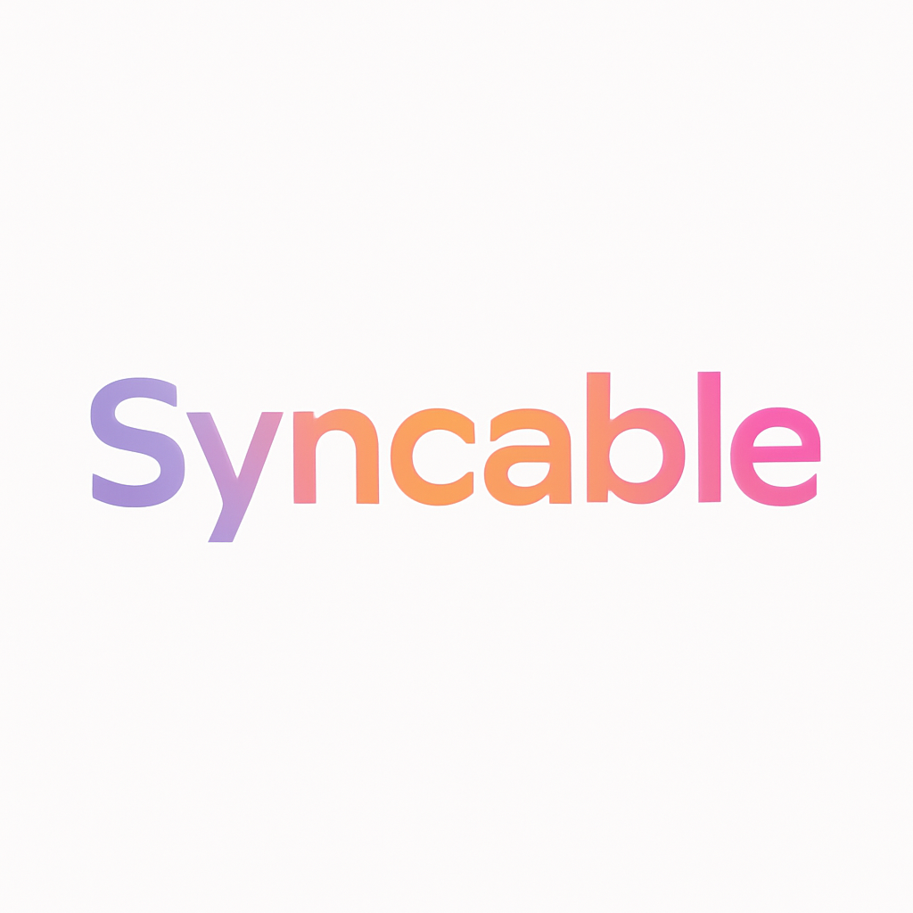

<p align="center">
  
</p>

<h1 align="center">Syncable CLI</h1>

<p align="center">
  <strong>DevOps toolbox for AI coding agents and developers</strong>
</p>

<p align="center">
  <!-- Build & Quality -->
  <a href="https://github.com/syncable-dev/syncable-cli/actions/workflows/ci.yml"></a>
  <a href="https://crates.io/crates/syncable-cli"></a>
  <a href="https://www.npmjs.com/package/syncable-cli-skills"></a>
  <br>
  <!-- Downloads & Community -->
  <a href="https://crates.io/crates/syncable-cli"></a>
  <a href="https://github.com/syncable-dev/syncable-cli/stargazers"></a>
  <a href="https://github.com/syncable-dev/syncable-cli/commits/main"></a>
  <br>
  <!-- Tech Stack -->
  <a href="https://www.gnu.org/licenses/gpl-3.0"></a>
  <a href="https://www.rust-lang.org/"></a>
  <a href="https://github.com/syncable-dev/syncable-cli"></a>
</p>

<p align="center">
  <a href="#-quick-start">Quick Start</a> •
  <a href="#-ai-agent-skills">AI Agent Skills</a> •
  <a href="#-commands">Commands</a> •
  <a href="#-installation">Installation</a> •
  <a href="https://syncable.dev">Syncable Platform →</a>
</p>

---

## What is Syncable CLI?

Syncable CLI (`sync-ctl`) is a DevOps toolbox that analyzes codebases, scans for security issues, validates infrastructure files, and deploys to cloud providers. It works standalone from the terminal or through **AI coding agent skills** — giving Claude Code, Codex, Gemini CLI, Cursor, and Windsurf the ability to run security scans, check for CVEs, lint Dockerfiles, and deploy services through natural conversation.

## ⚡ Quick Start

### For AI coding agents (recommended)

```bash
npx syncable-cli-skills
```

This installs 11 skills (7 command + 4 workflow) into your AI coding agent. Then just ask:

- *"assess this project"* — full health check
- *"scan for security issues"* — secrets and credential detection
- *"check for vulnerabilities"* — CVE scanning across all dependencies
- *"validate my Dockerfiles"* — lint IaC files
- *"deploy this service"* — cloud deployment with preview

### For direct CLI use

```bash
cargo install syncable-cli
sync-ctl analyze .

# Generate a CI pipeline skeleton (GitHub Actions, Azure Pipelines, or Cloud Build)
sync-ctl generate ci . --platform gcp --dry-run   # preview without writing files
sync-ctl generate ci . --platform azure            # write azure-pipelines.yml
sync-ctl generate ci . --platform hetzner --notify # with Slack failure alert

# Generate a CD pipeline skeleton
sync-ctl generate cd . --platform gcp --target cloud-run --dry-run
sync-ctl generate cd . --platform azure --target aks -o ./pipelines
sync-ctl generate cd . --platform hetzner --target vps --notify

# Generate both CI + CD in one shot
sync-ctl generate ci-cd . --platform gcp --target cloud-run --dry-run
sync-ctl generate ci-cd . --platform hetzner --target vps --notify
```

## 🤖 AI Agent Skills

One command installs skills for all major AI coding agents:

```bash
npx syncable-cli-skills
```

| Agent | Install Path | Format |
|-------|-------------|--------|
| **Claude Code** | Plugin marketplace | `SKILL.md` with plugin.json |
| **Codex** | `~/.agents/skills/` | `SKILL.md` directories |
| **Gemini CLI** | `~/.gemini/<profile>/skills/` | `SKILL.md` directories |
| **Cursor** | `.cursor/rules/` | `.mdc` with `alwaysApply` |
| **Windsurf** | `.windsurf/rules/` | `.md` with `trigger: always` |

### What the skills teach your agent

**Command skills** — atomic wrappers around `sync-ctl` commands:

| Skill | What it does |
|-------|-------------|
| `syncable-analyze` | Detect tech stack, languages, frameworks, dependencies |
| `syncable-security` | Scan for secrets, hardcoded credentials, insecure patterns |
| `syncable-vulnerabilities` | Check dependencies for known CVEs across all ecosystems |
| `syncable-dependencies` | Audit licenses, production vs dev split, package details |
| `syncable-validate` | Lint Dockerfiles, Compose files, K8s manifests, Helm charts, Terraform |
| `syncable-optimize` | Analyze Kubernetes resource requests, limits, cost efficiency |
| `syncable-platform` | Authenticate, switch projects/environments, deploy to cloud |

**Workflow skills** — multi-step orchestrations with decision logic:

| Skill | What it does |
|-------|-------------|
| `syncable-project-assessment` | Full health check: stack + security + vulnerabilities + dependencies |
| `syncable-security-audit` | Deep pre-deployment review with paranoid-mode scanning |
| `syncable-iac-pipeline` | Validate all IaC files + Kubernetes optimization |
| `syncable-deploy-pipeline` | End-to-end: auth → analyze → security gate → deploy + monitor |

### How it works

Skills teach your AI agent to use `sync-ctl` with the `--agent` flag, which outputs compressed JSON instead of terminal formatting. The agent gets a summary with the key findings, plus a reference ID to retrieve full details on demand:

```bash
# Agent runs this (compressed output, ~2KB)
sync-ctl security . --mode balanced --agent

# Agent drills into details only when needed (paginated)
sync-ctl retrieve <ref_id> --query "severity:critical" --limit 10
```

This keeps the agent's context window small while giving access to the full data.

## 🔍 Commands

### Project Analysis
```bash
sync-ctl analyze .                    # Human-readable matrix view
sync-ctl analyze . --agent            # Compressed JSON for agents
```
Detects 260+ technologies across JavaScript, Python, Go, Rust, and Java ecosystems.

### Security Scanning
```bash
sync-ctl security . --mode balanced   # Standard scan
sync-ctl security . --mode paranoid   # Deep compliance audit
```

| Mode | Speed | Use Case |
|------|-------|----------|
| `lightning` | Fastest | Pre-commit hooks |
| `fast` | Fast | Development |
| `balanced` | Standard | Default |
| `thorough` | Complete | PR reviews |
| `paranoid` | Maximum | Compliance audits |

### Vulnerability Detection
```bash
sync-ctl vulnerabilities .            # Scan all dependencies for CVEs
sync-ctl vulnerabilities . --severity high  # Only high+ severity
```
Scans npm, pip, cargo, go, and Java dependencies. Automatically discovers and scans all subdirectories in monorepos.

### IaC Validation
```bash
sync-ctl validate .                   # Lint all IaC files
sync-ctl validate . --types dockerfile,compose  # Specific types
sync-ctl validate . --types compose --fix       # Auto-fix issues
```

| Linter | What it checks | Rules |
|--------|---------------|-------|
| **Hadolint** | Dockerfiles | 60+ rules |
| **Dclint** | Docker Compose | 15 rules (8 auto-fixable) |
| **Kubelint** | K8s manifests | 63+ security & best-practice checks |
| **Helmlint** | Helm charts | 40+ rules |

### Deployment
```bash
sync-ctl deploy preview .             # Get deployment recommendation (JSON)
sync-ctl deploy run . --provider hetzner --port 8080 --public  # Deploy
sync-ctl deploy status <task_id> --watch  # Monitor progress
sync-ctl deploy wizard                # Interactive wizard (for humans)
```

### Platform Management
```bash
sync-ctl auth login                   # Authenticate with Syncable
sync-ctl project current              # Show current context
sync-ctl org list                     # List organizations
sync-ctl project select <id>          # Switch project
sync-ctl env select staging           # Switch environment
```

## 📦 Installation

### Cargo (recommended)
```bash
cargo install syncable-cli
```

### From source
```bash
git clone https://github.com/syncable-dev/syncable-cli.git
cd syncable-cli
cargo install --path .
```

## 🌟 Supported Technologies

<details>
<summary><strong>260+ technologies across 5 ecosystems</strong></summary>

**JavaScript/TypeScript** — React, Vue, Angular, Next.js, Express, Nest.js, Fastify, and 40+ more

**Python** — Django, Flask, FastAPI, Celery, NumPy, TensorFlow, PyTorch, and 70+ more

**Go** — Gin, Echo, Fiber, gRPC, Kubernetes client, and 20+ more

**Rust** — Actix-web, Axum, Rocket, Tokio, SeaORM, and 20+ more

**Java/Kotlin** — Spring Boot, Micronaut, Quarkus, Hibernate, and 90+ more

</details>

## 🚀 Syncable Platform

This CLI is the foundation of the **Syncable Platform** — a complete DevOps solution that takes you from code to production:

- **One-click deployments** to AWS, GCP, Hetzner, or Azure
- **Team collaboration** with shared environments
- **Monitoring & logs** built-in
- **Cost optimization** recommendations

**[Get started at syncable.dev →](https://syncable.dev)**

## 🤝 Contributing

We love contributions! Whether it's bug fixes, new features, or documentation improvements.

```bash
git clone https://github.com/syncable-dev/syncable-cli.git
cd syncable-cli
cargo build
cargo test
cargo clippy && cargo fmt
```

See [CONTRIBUTING.md](CONTRIBUTING.md) for detailed guidelines.

## 📄 License

This project is licensed under the **GNU General Public License v3.0** (GPL-3.0).

See [LICENSE](LICENSE) for the full license text.

### Third-Party Attributions

The Dockerfile linting functionality (`src/analyzer/hadolint/`) is a Rust translation
of [Hadolint](https://github.com/hadolint/hadolint), originally written in Haskell by
Lukas Martinelli and contributors.

The Docker Compose linting functionality (`src/analyzer/dclint/`) is a Rust implementation
inspired by [dclint](https://github.com/zavoloklom/docker-compose-linter) by Sergey Kupletsky.

The Kubernetes manifest linting functionality (`src/analyzer/kubelint/`) is a Rust reimplementation
inspired by [KubeLinter](https://github.com/stackrox/kube-linter) by StackRox / Red Hat.

The Helm chart linting functionality (`src/analyzer/helmlint/`) is a Rust implementation
inspired by the official [Helm lint](https://helm.sh/docs/helm/helm_lint/) command.
