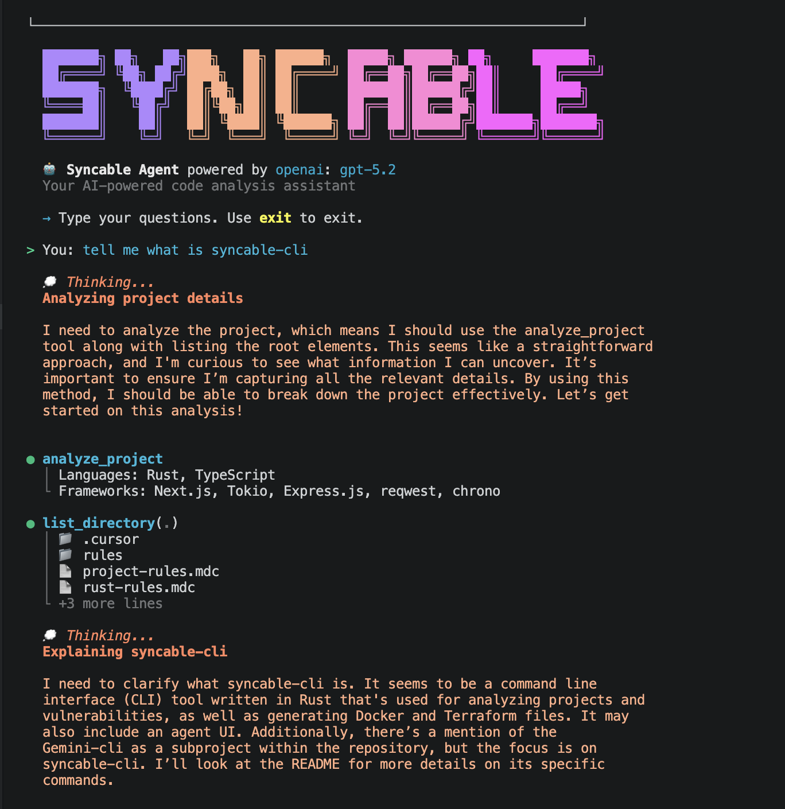
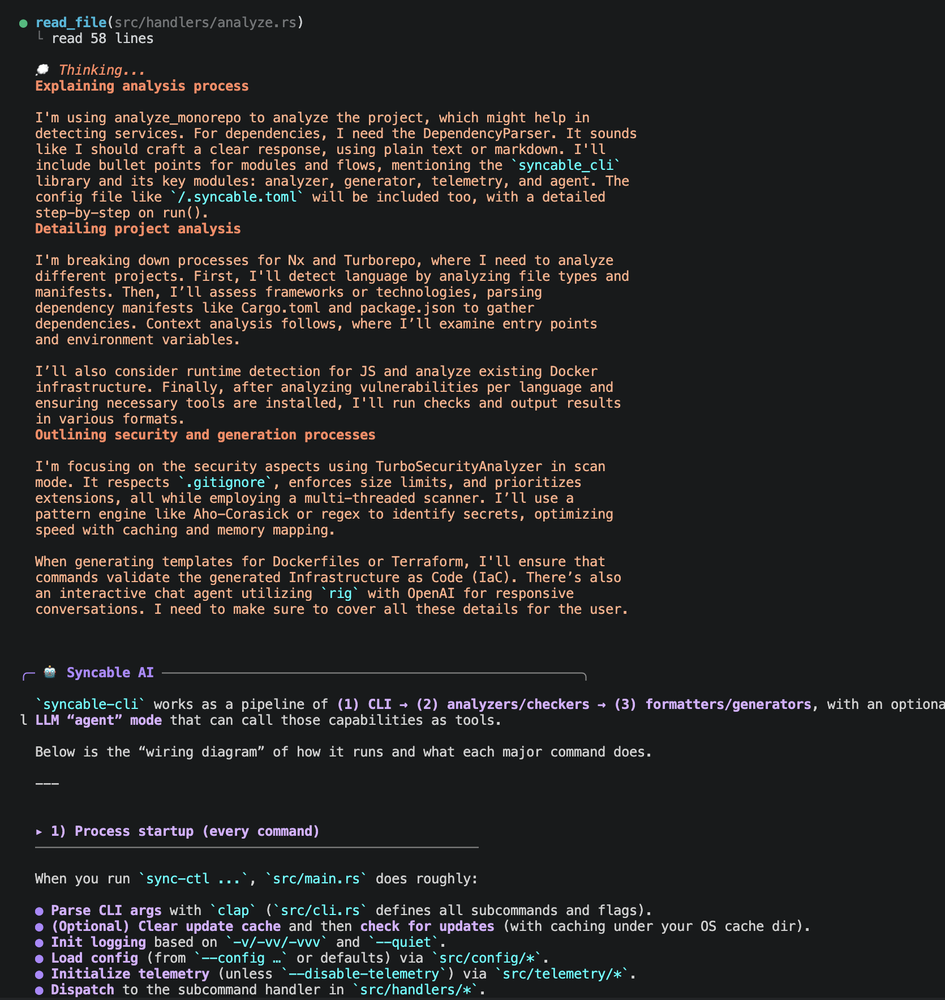
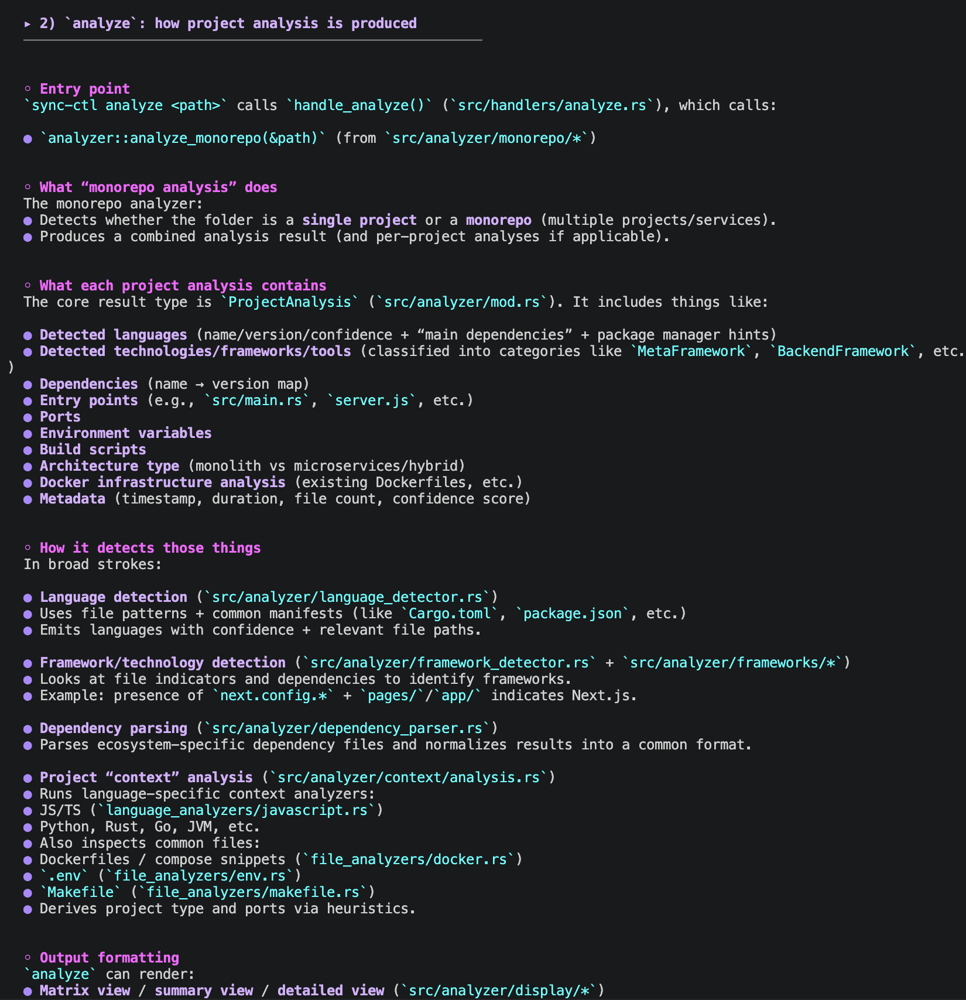

# Syncable IDE Companion

VS Code extension for [Syncable CLI](https://github.com/syncable-dev/syncable-cli) - enables native diff views when the AI agent modifies files.

## Installation

Install from [VS Code Marketplace](https://marketplace.visualstudio.com/items?itemName=syncable.syncable-ide-companion) or:

```bash
code --install-extension syncable.syncable-ide-companion
```

## Usage

1. Open your project in VS Code
2. Open the integrated terminal (`` Ctrl+` `` or `` Cmd+` ``)
3. Run `sync-ctl chat`
4. When the agent creates/modifies files, diffs open in VS Code's native diff viewer

## Screenshots

### AI Agent with Thinking & Tool Calls


### Code Analysis & Reasoning


### Detailed Project Analysis


## Features

- Native VS Code diff viewer for file changes
- Accept/reject changes with `Cmd+S` or toolbar buttons
- Automatic connection when running from VS Code terminal

## Requirements

- [Syncable CLI](https://github.com/syncable-dev/syncable-cli) installed (`cargo install syncable-cli`)
- VS Code 1.70.0+

## License

Apache-2.0
